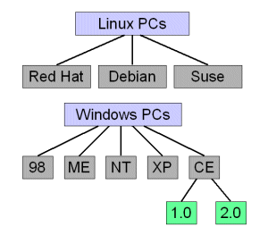
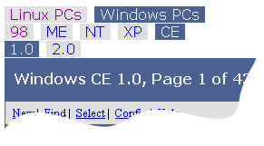
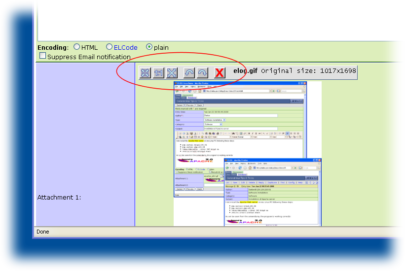
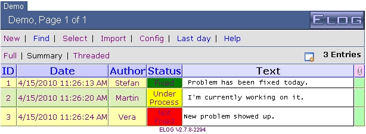
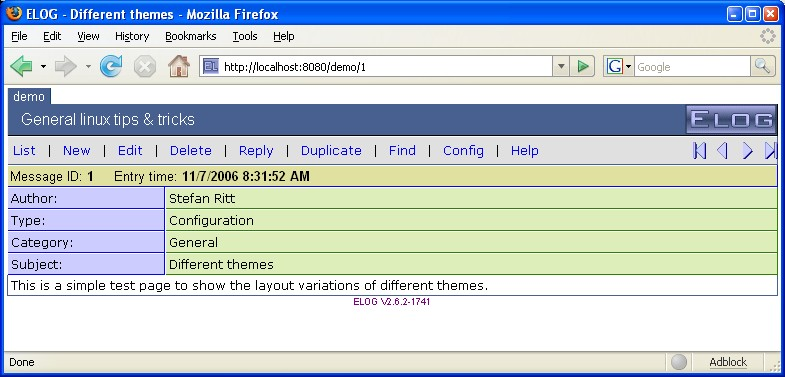
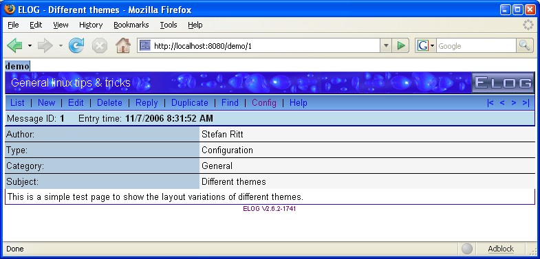
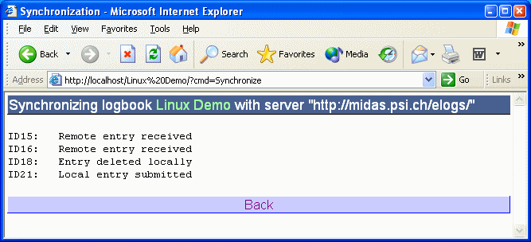

# ELOG - Syntax of elogd.cfg

*Global and individual logbook options for an ELOG server*

------------------------------------------------------------------------

The configuration file **`elogd.cfg`** contains entries which define the
structure of logbooks and the behaviour of **`elogd`**. The file has a
simple ASCII format. Each logbook is defined by a **`[<name>]`** section
where <name> is the name of the logbook. The **`[global]`** section is
used for settings common to all logbooks. Each line contains a setting
name, followed by an equal sign and the value for this setting. Lines
starting with ";" are treated as comments.

Here is a simple example, which define two logbooks, "*Linux*" and
"*PC*":

``` text
[global]
SMTP host = mailsend.your.domain

[Linux]
Theme = default
Comment = General linux tips and tricks
Attributes = Author, Type, Category, Subject
Options Type = Routine, Software Installation, Problem Fixed, Configuration, Other
Options Category = General, Hardware, Software, Network, Account, Other
Options Author = Stefan, Linus, unknown
Required Attributes = Author

[PC]
Comment = Database PC installations
Attributes = Location, OS, Owner
Options Location = Building1, Building2
Options OS = Linux, Windows ME, Windows 2000
Required Attributes = Location, Owner
Email All = name@address, othername@otheraddress
Use Mail Subject = Location
```

## Global options

The notation of the following options is such that items enclosed by
**"<"** and **"\>"** should be replaced by a specific string. If a
value contains blanks (like a complete sentence), it should **not** be
enclosed in quotation marks.

If a setting has a number of possible options, they are shown in the
form **`option1|option2|...`**, meaning that one of the options (without
any vertical bar) should be used. The following options are specific to
the **`[global]`** section:

### `Port = <port>`
Specifies the TCP port under which the server is listening. Default is
80. Can be superseeded via the '-p' command line flag.

### `SSL = <0 | 1>`
Turn on Secure Socket Layer transport. If SSL is on, one can connect via
**`https://...`** to the elogd daemon. If the **`URL =`** directive is
used, make sure to use **`https://...`** instead of **`http://...`**
there. The ELOG distribution contains a simple self-signed certificate
in the **`ssl`** subdirectory. One can replace this certificate and key
with a real ceritficate to avoid browser pop-up windows warning about
the self-signed certificate. The default for this option is **`0`**.

### `Interface = <interface>`
Specified network interface to listen at. Can be used if several network
cards are in a computer, or if one wants to restrict access to the local
host only, in which case one can use 127.0.0.1 as the interface.

### `Resource dir = <directory>`
Specifies the root directory for ELOG resources like help files, themes
and icons. Can be overwritten with the **`-s`** flag when starting
elogd. If not specified, use the directory where the configuration file
**`elogd.cfg`** resides. *Changing this option requires a restart of the
elogd server*.

### `Logbook dir = <directory>`
Specifies the root directory for logbooks. Can be overwritten with the
**`-d`** flag when starting elogd. If not specified, use the directory
where the configuration file **`elogd.cfg`** resides. Each logbook data
is stored in a separate directory under this root directory specified by
the **`Subdir`** option. *Changing this option requires a restart of the
elogd server*. This directory also contains any password file and user
HTML file.

### `Language = <name>`
The language setting determines the language of the **`elogd`** output.
Not affected by this setting are the configuration file options and the
commands specified with the optional **`Menu commands`** and
**`List menu commands`**, which have to be specified in English and are
translated automatically by elogd. The attribute names are unaffected by
the language setting and have to be translated manually.

If a language name is given (currently "*german*", "*french*",
"*spanish*", "*dutch*", "*brazilian*" are supported
out-of-the-box), the system searches for a file named
**eloglang.<name\>** containing string translations from English into
that language. *If you create a new translation file, please send it
back to the author to be included in future distributions*.\
\
The online help for **`elogd`** is contained in the file
**eloghelp\_*xx*.html** where *xx* are the first two letters of the
language (like "*en*", "*ge*" and "*fr*"). For new languages, a
new file of that type must be created as well.

### `charset = <name>`
Specifies the charset of the pages produced by **`elogd`**. Can be used
to switch to Russian or Asian fonts.

### `Logbook Tabs = [0|1]`
This flag controls the display of "*tabs*" on top of the logbook page
which allow to quickly switch between logbooks. Default is **`1`**

### `Main Tab = <string>`
If this option is present, an additional first tab is displayed which
takes you back to the main logbook selection page. The **`string`** is
used for the contents of the tab.

### `Main Tab URL = <string>`
Normally the main tab brings one back to the logbook selection page. In
case one wants to specify a different destination, such as a special web
page outside of elog, one can use this statement to specify a full URL.

### `Welcome Title = <html code>`
This optional HTML code gets displayed in the title of the logbook
selection page. It can contain images via **``**.
These images must be stored in the resource directory or in the theme
directory.

The following line is an example Welcome Title:

`Welcome title = <p><font size=5 color=white>Welcome to our Elog</font>`

This displays an image and a text below.

### `Page title = <string>`
The string specified here is used for the title of individual logbook
pages. It is also used by most browsers for bookmark names. <string\>
can contain substitutions like \$<attribute\> where <attribute\> gets
replaced by the attribute string from each message. The option
**`Page title`** in the **`[global]`** section is used for the logbook
selection page.

### `List page title = <string>`
The same for the summary or find result page. This may include
substitutions as well, although attribute substitutions make no sense
here, since the summary page may contain many messages with different
attributes.

### `Selection page = <file>`
When this option is present, a user defined file is displayed instead of
the logbook selection page. This file must be stored in the resource
directory. Alternatively, an absolute path can be used if the file name
starts with a **`"/"`** (Unix) or **`""`** or **`"x:"`** (Windows).
It can be completely customized in order to contain logos etc. As a
template, the standard selection page produced by **`elogd`** can be
used.

### `Guest Selection page = <file>`
The same for installations which have a global password file. This means
that the logbook selection page is also password protected. It might be
however that some logbooks have guest access, in which case guest access
to the selection page should be allowed as well (maybe with only a
subset of the available logbooks). In that case this options can be
used, to show a list of logbooks with guest access.

### `Protect Selection page = 0 | 1`
Normally, one can see the logbook selection page without having to log
in. If one wants to require a login for the selection page, this switch
can be set to **`1`**. Default is **`0`**. It is necessary to put the
**`Password file = ...`** into the *\[global\]* section of the config
file for this to work.

### `Expand Selection page = 0 | 1`'
If this option is not present or set to one, the logbook selection page
is expanded (all logbooks are shown if groups of logbooks are present).
If this option is zero, only the group names are displayed. If one
clicks on a group, its logbooks are shown. Using this option set to zero
only makes sense if one has a large number of logbooks which would not
fit on a single browser window, so collapsing makes sense. Default is
**`1`**.

### `SMTP host = <host.domain>`
This defines the SMTP host needed to send automatic email notifications.
The host name you can get from your email program or your local system
administrator.

### `SMTP username = <username>`
Some SMTP server require username/passowrd authentication. This option
specifies the SMTP user name, while the option **`SMTP password`** can
be created or modified via the **`-t`** switch when starting elogd. This
is necessary since the password is encrypted. To set your SMPT password,
enter on the command line:


`elogd -t <your password>`

### `SMTP port = <port>`
This defines the port under which the SMTP server is listening. The
default is 25, but some newer servers use port 587.

### `Logfile = <file>`
This option specifies a filename which logs all login/logout activities
and successful user connections for logbooks with user level access. The
the **`logging level`** (see below) is larger than 1, also read and
write accesses can be logged.

### `Logging level = 1 | 2 | 3`
Specifies the logging level. The higher this value, the more information
is logged. Default is **2**:

- **1:** Log only logins and logouts
- **2:** Log also write accesses
- **3:** Log also read accesses

### `URL = <http[s]://host.domain[:port]/[subdir/]>`

If one of the three cases is true:

- **`elogd`** runs with *SSL* enabled
- **`elogd`** runs under a proxy
- The automatic email notifications contains the wrong URL

then the URL under which **`elogd`** is running has to be specified
manually with this statement. The URL has to contain the port number if
not the standard port 80 is used or 433 for SSL, and it has to contain
the directory if used under a proxy like

URL                                 | Condition
------------------------------------|-----------------------------
`URL = http://host.domain:8080/`    |if running on port 8080
`URL = https://host.domain/`        |if SSL is enabled (SSL = 1)
`URL = http://host.domain/subdir/`  |if running under a proxy

This URL is then used for any redirection. For example if one submits a
new entry, the URL in the browser reads
**...<logbook\>/?cmd=Submit&\...**, containing all the attributes etc.
After the submit this page gets redirected to
**...<logbook\>/<ID\>**, where <ID\> is the ID of the new entry. For
the redirection via the HTTP "Location:" statement, an absolute URL is
required. Since elogd cannot figure out the complete URL under which it
is running when accessed through an Apache proxy, this statement is
necessary to tell elogd the complete URL.

### `Relative redirection = 0|1`
Under some circumstances, absolute redirection via a complete URL may
not work. If you access elogd through two different ways
simulataneously, for example directly and via a stunnel connection, a
single absolute URL cannot be used, because one connection starts with
**http://**, and the other with **https://**. Another case is when the
elogd server has a dynamic IP address, which changes from time to time.
Setting **`Relative redirection = 1`**, relative redirection is used.
This uses the current URL from the browser, whatever it is, and only
specifies the last part of the URL. It should noted however that
relative redirections are not allowed in the HTTP standard, but most
browsers support it anyhow. Problems have been reported with the Safari
browser. So this option should only be used when it is really needed.

``` text
Usr = <name>
Grp = <name>
```

The user and group to run the elogd daemon under when started by root.

### `Resolve host names = 0|1`
Resolve remote host names if set to **1**. If set to **0**, which is the
default, only IP numbers are stored in any log file. If the
**`hosts allow/deny`** options are used with host names, this setting
must be set to **1**. If turned on, the DNS server is contacted on each
HTTP request to elog, which can slow down the server considerably for
slow DNS servers.

## Groups of logbooks

If installations have very many logbooks, it can be hard to navigate
between them. To make things more structured, it is possible to build a
hierarchy of logbooks. A logbook group can contain any number of
logbooks as well as other logbook groups. The hierarchy is defined with
the the option

**`Group <group name> = <Logbook1>, <Logbook2>, <other group>`**

in the **`[global]`** section of the configuration file.

To define following logbook hierarchy:



one would use following statements:

``` text
[global]
Group Linux PCs = Red Hat, Debian, Mandrake
Group Windows PCs = 98, ME, NT, XP, CE
Group CE = 1.0, 2.0
```

The logbook tabs would then look like this:



Where the selected group or logbook becomes blue. The lower
groups/logbooks change according to the selected upper group. Please
note that a logbook can be contained in more than one group, but then it
should not be the first logbook in those groups. The colors of the tabs
and the title bar can be specified in the CSS file.

## Top groups

Sometimes groups of logbooks should be completely separate. Imagine two
groups of logbooks, one for the engineering department and one for the
administration department. These groups should have different
administrators, and the logbook tabs at the top of the screen should not
show the logbooks from the other department. Prior to ELOG version
2.4.1, one had to run two elogd servers in parallel, listening under
different ports. Since 2.4.1, one can achieve the same behaviour using
**`Top groups`**. The configuration could look like this:

``` text
Group Linux PCs = Red Hat, Debian, Mandrake
Group Windows PCs = 98, ME, NT, XP, CE
Group CE = 1.0, 2.UL

Top group engineering = Linux PCs, Windows PCs
Top group administration = Employees, Purchases

[global engineering]
Password file = engineers.pwd
Admin user = stefan

[global administration]
Password file = admin.pwd
Admin user = bill
```

Note that there can be a **`[global]`** section for each top level group
of logbooks. The rule is that a configuration setting in an individual
logbook section overrides a setting in the **`[global <top group>]`**
setting, which by itsel overrides a setting in the **`[global]`**
section. This way one can define settings for all top level groups (such
as the SMTP host) in the **`[global]`** section, and define different
password files and administrators in the individual top level group
sections.

If top groups are used, the root of the elogd server is not accessible
any more. Presume that elogd is accessible normally under
**`http://your.host:8080/`**, this URL becomes invalid for top groups,
to avoid the case that one group can "see" the logbooks of the other
groups. Instead, one has to append the top group name to the URL, such
as **`http://your.host:8080/engineering`** or
**`http://your.host:8080/administration`**. If someone does not know the
top group name, one cannot see the list of logbooks there, so the groups
become completely independent of each other. If this feature is not
wanted, it can be disabled by setting **`Show top groups = 1`**.

## Individual logbook options

For each logbook, there is a section with the logbook name in square
brackets, so that each logbook can have different options. If an option
is not present in a logbook section, then the system tries to locate
that option in the **`[global]`** section. Thus if the following options
are placed in the **`[global]`** section, they are defaults for all
logbooks. If they are present in the **`[global]`** and in the logbook
section, the logbook option is used.

Here are the available options, by broad categories:

## General options

### `Data dir = <directory>`
  This option is obsolete from version 2.2.5 on and should not be used.
  Use **`Subdir = ...`** instead.

###`Subdir = <directory>`
  Each logbook has a separate directory where the logbook entries are
  stored, which is controlled by this statement. If the directory does
  not exist, it is created autmatically by the **`elogd`** program. The
  subdirectory is relative to the logbook root directory specified with
  the **`Logbook dir = ...`** option. So if
  **`Logbook dir = /usr/local/elog/logbooks`** and **`Subdir = Demo`**
  then the logbook data is stored in
  **`/user/local/elog/logbooks/Demo`**. If the **`Logbook dir = ...`**
  option is not specified, then **`logbooks`** is used. If the
  subdirectory starts with a "/" ("\\" under Windows), then it is
  used as an absolute path independent of the logbook dir. To see which
  directories are used, start **`elogd`** with the "-v" flag.

### `Comment = <comment>`
  The comment is displayed on the logbook selection list. The selection
  list is displayed if more than one logbook is defined on a host and no
  logbook is explicitly specified in the URL.

### `Theme = <theme>`
  A theme determines which layout and colors are used for a logbook,
  similar to *skins* in other programs. The *theme* option points to a
  subdirectory under the *"themes"* directory which resides in the
  resource directory. It contains all files for that theme. The format
  of these files is described under the *Themes* section.

### `CSS = <filename>`
  A given theme can contain several Cascading Style Sheets (CSS). This
  can be usefule if several logbooks use the same images and icons, but
  differnt colors. By default, the CSS *elog.css* is used. This
  statement adds an additional CSS, which can overwrite settings from
  *elog.css*. If different CSS'es should be used for different output
  media, this can be accomplished with a comma- separated list in the
  form **`CSS = <file1>&<media1>,<file2>&<media2>`**. This will then be
  translated into separate style sheet statements for the different
  media. For example a statement
  **`CSS = default.css&screen,print.css&print`** will result in the HTML
  statements:

``` text
        <link rel="stylesheet" type="text/css" href="default.css" media="screen">
        <link rel="stylesheet" type="text/css" href="print.css" media="print">
```            

### `Title image = <string>`
  HTML code for the icon in the upper right corner. By default,
  following code is used:

  

  This code can be replaced by **`<string>`** to display a different
  icon file, or to display some text. The icon image has to be present
  in the theme directory, which is usually
  **`<elog root>/themes/default`**.

### `Title image URL = <URL>`
  The ELOG icon at the right upper corner usually points to the ELOG
  home page. This URL can be changed to point to a corporate page for
  example with this option. The icon can be changed by replacing the
  **`elog.gif`** icon in the theme directory. This option should only be
  used if the **`Title image`** option is not used.

### `Time format = <string>`
  This option determines how the date and time of a logbook entry is
  displayed. The format of the string is the same as the C function
  [strftime](strftime.txt), so a string of **%A, %B %d, %Y, %H:%M**
  yields in a display of **Thursday, November 15, 2001, 12:35** for
  example.

### `Time format <attribute> = <string>`
  Same, but just for an individual attribute.

### `Date format = <string>`
  This option determines how the date is displayed from attributes which
  are of type "date". The format of the string is the same as the C
  function [strftime](strftime.txt), so a string of **%A, %B %d, %Y**
  yields in a display of **Thursday, November 15, 2001** for example.

### `Date format <attribute> = <string>`
  Same, but just for an individual attribute.

### `Welcome Page = <file>`
  By default, the list with the last twenty entries of a logbook is
  displayed when the logbook is selected. This can be overridden with
  this option, which causes a HTML file to be shown instead of the
  message list. This file can contain further links for new logbook
  messages of for logbook queries. Here is a simple example of such a
  file:

``` text
<h1>Welcome to the test logbook</h1>
<ul>
  <li><a href="?cmd=new">Enter</a> a new message
  `<li><a href="?cmd=find">Search</a> the logbook
</ul>
```

  The file must be present in the resource directory. Alternatively, an
  absolute path can be used if the file name starts with a **`"/"`**
  (Unix) or **`""`** or **`"x:"`** (Windows).

### `Start page = <command>`
  This option can be used to display a different start page.
  **`command`** can be either *0?cmd=Last* to display the last message,
  or any other ELog menu command in the form **`?cmd=xxx`**. To start
  with the search page, one uses


  `Start page = ?cmd=Find`

  Please note that if another language than English is selected via the
  **Language = xxx** option, the commands have to be in that language as
  well (like *"Start page = 0?cmd=Letzter"* for German).

### `Submit Page = <file>`
  This optional page can be displayed when a new message was submitted
  in a logbook. Here is an example:

``` text
<h1>You successfully submitted a message</h1>
<a href="?cmd=Back">Back</a> to the logbook<p>
<a href="?cmd=New">Enter</a> another message
```      

  The file must be present in the logbook directory. Alternatively, an
  absolute path can be used if the file name starts with a **`"/"`**
  (Unix) or **`""`** or **`"x:"`** (Windows).

### `Message comment = <comment>`
  This optional comment is displayed on top of the text entry field when
  submitting a new message. It can contain a sentence like "*Please
  enter your message here*:".

### `Reply comment = <comment>`
  This optional comment is displayed on top of the text entry field when
  replying to an exiting entry. It can contain a sentence like "*Please
  enter your reply here*:".

### `Attachment comment = <comment>`
  This optional comment is displayed on top of the attachment sumbission
  section when entering a new message. It can contain a sentence like
  "*Please upload your attachments here*:".

### `Menu commands = <list>`
  This option specifies the menu commands displayed on top of a single
  logbook page. For certain installations, it can be useful to disable
  some commands. Following commands are possible:

  - **New** - Enter new logbook entry
  - **Edit** - Edit current logbook entry
  - **Delete** - Delete current logbook entry
  - **Reply** - Submit a reply to current entry
  - **Duplicate** - Duplicate the current entry with the possibility to
    change some values
  - **Download** - Download a message in ASCII format
  - **Find** - Search entries in logbooks
  - **Last day** - Display entries from last day
  - **Move to** - Move entry to other logbook
  - **Copy to** - Copy entry to other logbook
  - **Config** - Edit elogd.cfg (if **no** "*Password file*" is given)
  - **Config** - Modify/Add user accounts (if "*Password file*" is
    given)
  - **Admin** - Edit elogd.cfg (if "*Password file*" is given)
  - **Login** - Login with user name and password (if "*Password
    file*" is given)
  - **Import** - Show CSV (comma-separated-values) import page
  - **Logout** - Logout current user (if "*Password file*" is given)
  - **Help** - General help

  The commands are always in English, independent of the
  **`language = ...`** setting, and are automatically translated into
  the specified language.

  If this option is not present, following default is used:


`Menu commands = List, New, Edit, Delete, Reply, Duplicate, Find, Config, Help`

### `Copy to = <logbook list>`
### `Move to = <logbook list>`

  The commands **`Copy to`** and **`Move to`** make it possible to copy
  or move a logbook entry from one logbook to another. By default, all
  logbooks except the current logbook are shown as a possible
  destination. With the configurations options
  **`Copy to = <logbook list>`** and **`Move to = <logbook list>`** it
  is possible to specify a list of destination logbooks, separated by
  commata. This can make sense if only certain logbooks make sense as
  destinations. The flag **`Preserve IDs`** can be used to keep the
  entry ID in the destination logbook.

### `List Menu commands = <list>`
  This option specifies the menu commands displayed on top of the
  listing page. Although all commands from a above are possible, only
  the commands
  **`New, Find, Select, Import, Config, Admin, Change password, Logout`**
  and **`Help`** make sense. The command **`Select`** can be used to
  select multiple messages for deletion or for moving to other logbooks.
  Once the **`Select`** command is clicked, check boxes appear in front
  of all entries which let the user select one or more entries. A new
  menu bar shows up with a **`Delete`** and optionally a
  **`Coyp to ...`** and **`Move to ...`** button, if these commands are
  present in the **`Menu commands`** list. Pressing one of these buttons
  deletes, copies or moves all selected logbook entries.

### `Guest Menu commands = <list>`
  This option specifies the menu commands for guest logins. A guest
  login happens if a password file is used, but someone accesses the
  logbook for the first time, which means that no username/password is
  given. In that case the commands from the guest menu are displayed,
  which usually contain a subset of the normal commands. A typical
  scenario is a logbook which only has commands to read the logbook on
  the guest menu, but no commands to write/edit entries. Instead, the
  **login** command is given in the guest menu, with which one can login
  as a real user (username and password have to match those from the
  password file), which then allowes full access via the **"Menu
  commands"** list. A typical example for the menu settings for this
  scenario are:

``` text
  Menu commands = List, New, Edit, Reply, Duplicate, Find, Config, Logout, Help
  Guest menu commands = List, Find, Login, Help
```

  Note that the presence of this option opens user access also to the
  find result or elog listing page, which usually contains some config
  command. So it is useful to combine the **`Guest menu commands`**
  option with the following **`Guest List Menu commands`** option to
  restrict the access to the find result page as well.

### `Guest List Menu commands = <list>`
  Same as **Guest Menu commands** but for the find result page.

### `Menu text = <file>`
  If this option is present, and additional menu row above the message
  gets displayed with the contents of <file\>. This file can contain
  arbitrary text, images or links. One example would be following text
  to go back to the listing page and display the next *Routine* entry
  and all *Routine* entries:

``` text
<small>
&nbsp;<a href="?cmd=next&type=Routine">Next Routine entry</a>&nbsp;|
&nbsp;<a href="../?Type=Routine">All Routine entries</a>
</small>
```

### `List Menu text = <file>`
  The same for the list page.

### `Filter Menu text = <file>`
  The same for the filter line in the list page.

### `Guest Display = <list>`
  This option specifies which attributes are displayed on guest access.
  It is possible to display only a subset of all attributes for guest
  access, but the full list if someone is logged in (using the option
  "Password file"). The **`list`** consists of comma separated
  attributes, including the word *text*, if one wants to display the
  entry body text for guests.

``` text
<small>
&nbsp;<a href="?mode=summary">Summary</a>&nbsp;|
&nbsp;<a href="?mode=full">Full</a>&nbsp;|
&nbsp;<a href="?mode=threaded">Threaded</a>&nbsp;|
</small>
```      

### `Top text = <file> | <string>`
  The text of this option gets displayed at the top of every Elog page.
  It can be a string or a filename which gets displayed. Might be useful
  to display company logos etc. If a file is specified, it must be
  present in the logbook directory. Alternatively, an absolute path can
  be used if the file name starts with a **`"/"`** (Unix) or **`""`**
  or **`"x:"`** (Windows).

### `Bottom text = <file> | <string>`
  The text of this option gets displayed at the bottom of every Elog
  page instead of the little Elog home page link. It can be a string or
  a file. It can contain for example a link back to the main logbook
  selection page like:


`<center><a href="/">Main page</a></center>`

  Or it can contain other useful links. If a file is specified, it must
  be present in the logbook directory. Alternatively, an absolute path
  can be used if the file name starts with a **`"/"`** (Unix) or
  **` ""`** or **`"x:"`** (Windows).

### `Bottom text login = <file> | <string>`
  The same as **`Bottom text`** but for the login page. This allows to
  display a different text at the bottom of the login page. It can also
  be used to execute some JavaScript.

### `Help URL = <URL>`
  This URL is used for the Help button. By default, the file
  **eloghelp_xx.html** is returned with the contents of the help page.
  Edit this file directly to add site-specific help for all logbooks.
  Alternatively, use the **`Help URL`** option to specify different help
  pages for different logbooks. It can point to a site-specific help
  page via **`http://...`** or to a local file like
  **`file://c:/tmp/config.html`**, or to the name of an HTML file which
  must be present in the resource directory.

### `Message Width = <number>`
  This value sets the number of characters per line of the main message
  entry field. The default value is 76 (78 for replies), and can be
  increased for installations which need a larger window size (like
  pasting log files etc.). If both **`Message Width`** and
  **`Message Height`** are not given, some JavaScript code is used which
  automatically resizes the message window dynamically to fit optimally
  into the browser window.

### `Message Height = <number>`
  This value sets the number of lines of the main message entry field.
  The default value is 20, and can be changed for installations which
  need a different window size. If both **`Message Width`** and
  **`Message Height`** are not given, some JavaScript code is used which
  automatically resizes the message window dynamically to fit optimally
  into the browser window.

### `Admin textarea = <cols>,<rows>`
  This defines the textarea size for the admin page. Default is
  **80,40**.

### `Display mode = [full|summary|threaded]`
  Default mode for search display. On the find entry form, the
  checkboxes are set accordingly. The "Last xxx" page uses this
  setting directly.

### `Entries per page = <number>`
  Number of logbook entries displayed per page in a search result. The
  default is 20.

### `Restrict edit time = <hours>`
  If this option is set, a new message can only be edited a certain
  number of hours after its creation. This can be useful if one wants to
  ensure that old entries cannot be modified. Hours can also be
  fractional, like 0.5 for 30 min.

### `Admin restrict edit time = <hours>`
  Same option for admin users. This can be useful if normal users are
  not allowed to change entries after "restrict edit time", but an
  admin user should be allowed to do so. Setting this to zero disables
  any restriction for admin users and they can edit entries forever.

### `Max content length = <bytes>`
  This option restricts the size of attachments. When very large
  (\>100MB) attachments are uploaded, the elogd server can be busy with
  this upload for a longer time and not respond to other requests during
  that time. To avoid this, the maximum size of attachments can be
  restricted. The server will then refuse to accept larger attachments.
  The default is 10485760 (= 10 MB). This option has to be placed into
  the \[global\] section and the elogd server has to be restarted after
  a change.

### `Fonts = <list>`
  List of fonts (comma separated) to be shown in the font drop-down box
  of the entry edit form. Default is
  
`Fonts = Arial, Comic Sans MS, Courier New, Tahoma, Times New Roman, Verdana`

  On Unix systems some of these fonts might not be installed, in which
  case they can be replaced by others like **Serif**, **Sans-serif**,
  **Helvetica**.

### `All display limit = <n>`
  If a logbook contains many entries, the list gets divided into pages,
  with some page navigation for the next, previous, a specific page and
  all pages. If the logbook contains a large number of entries (\>500),
  the display of all thes entries can take very long and might slow down
  the elogd server, especially if the entries are not displayed in
  "summary" mode but in "full" mode. Therefore the "All" link
  should not be used in the page navigation for large logbooks. The
  number of entries from when on the "All" link gets hidden can be
  specified with this number, the default value is **`500`**.

### `Thumbnail size = <size>`
  This option determines the default thumbnail size. To make the
  automatic generation of thumbnails working, the ImageMagick package
  has to be installed. Refer to the [admin
  guide](adminguide.md#installing-imagemagick) for installation instructions.
  The thumbnail size **`size`** gets passed to the **`-thumbnail`**
  option of the conversion. A value of **`300`** converts all pictures
  to thumbnails 300 pixels wide. A value of **`300>`** converts all
  pictures to thumbnails 300 pixels wide if they are larger than 300
  pixels initially, and leaves them untouched if they are smaller. A
  value of **`10%`** converts all pictures to 10% of their original
  size. If the thumbnail size option is missing, the thumbnails will be
  created with the original image size, and can then be resized and
  rotated interactively with the image manipulation buttons:

  

  Setting **`Thumbnail size = 0`** turns off the thumbnail creation.

### `Thumbnail options = <options>`
  With this option one can pass additional parameters to the ImageMagick
  package. They are passes 1:1 to the **convert** program. Commonly used
  is the **-density** option to increase the image quality when
  converting from PDF or EPS files.

## Attributes

### `Attributes = <list>`
  Define a number of attributes for the logbook, separated by commata. A
  maximum of 100 attributes can be defined. Typical values are
  "*Author*", "*Subject*" or "*Type*". Following values are not
  allowed:

  - Text
  - Date
  - Encoding
  - Reply to
  - In reply to
  - Locked by
  - Attachment
  - Path

  since these are used internally by elog.

### `Options <attribute> = <list>`
  Usually, an text field is used for an attribute, where the user can
  fill in text of up to 100 characters. If instead a drop-down box with
  preset items is better for a given attribute, these items can be
  defined with this statement. Up to 100 items can be defined, separated
  by commas. To add an option including a comma, encose it in quotations
  marks like


`Options town = San Francisco, "Paris, Texas", "Paris, France"`

### `Extendable options = <list>`
  When using the **`Options <attribute>`** to specify a list of possible
  options, this list is fixed. Sometimes it is desirable to extend the
  list when a new entry in a logbook is made and a certain option is
  missing on the list. By adding the attribute name to the
  **`Extandable options`** list, a button appears next to the attribute
  in the message entry form which lets you add new options to the list.
  The elogd.cfg configuration file is then automatically updated. When a
  new logbook entry gets made, the new option automatically appears in
  the drop-down box for that attribute.

### `ROptions <attribute> = <list>`

  Same as **`Options`** above, but using radio buttons instead of a
  drop-down box.

### `MOptions <attribute> = <list>`

  This list allows for "*Multiple Options*", meaning that an attribute
  can have several values simultaneously. When entering an entry with
  MOptions, each value from the list is represented by a checkbox.
  Unlike with normal options, multiple checkboxes can be checked for an
  entry. The attribue value then becomes


`<value1> | <value2> | ...`

  In the "*find*" page only one of these values can be specified,
  which is then treated as a substring in the search filter.

### `IOptions <attribute> = <list>`
  This list specifies a set of icons for an attribute. Some icons are
  contained in the *themes/default/icons* directory which can be used
  here like
  
``` text
Attributes = Author, Icon, Subject...
IOptions Icon = icon1.gif, icon2.gif, icon3.gif, ...
```

  New icons are welcome and should be sent back to the author to be
  incorporated in the next version.

### `Comment <attribute> = <comment>`
  Optional comment which is displayed below the attribute name in the
  entry form. Can be used to explain the attribute somehow.

### `Tooltip <attribute> = <comment>`
  Same as **`Comment <attribute>`**, except that the comment gets
  displayed as a tooltip (tiny pup-up window) when the user moves the
  mouse cursor over the attribute name in the entry form.

### `Tooltip <attribute> <attribute option> = <comment>`
  Same as **`Tooltip <attribute>`**, but for option values of a
  **`MOptions`** attribute. Using this option, a different tooltip can
  be shown above each check box of an optional value for an attribute.
  Please note that attributes or options with spaces should **not** be
  enclosed with quotes.

### `Icon comment <icon> = <comment>`
  Icons may contain a comment, which is then used in email notifications
  instead of the icon file name. One has to add a separate icon comment
  for each icon file.

### `Options <attribute> = boolean`
  If an attribute is marked "*boolean*" this way, a checkbox is
  displayed for this attribute.

### `Preset <attribute> = <string>`
  This option uses a preset string for an attribute. The string can
  contain subsitutions like the ones described under the "*Subst
  <attribute\>*" command. One possible application is to use the login
  name for the author field like:


`Preset Author = $long_name`

  If the attribute should be locked at the Web submission, use the
  "*Locked Attributes = \...*" option. If a preset value is given for
  an attribute which has an options list, the preset value is selected
  in the drop down box by default.

### `Preset text = <string> or <file>`
  This preset value is used for the main body text. It can be a string
  or a file, which must be present in the logbook directory.
  Alternatively, an absolute path can be used if the file name starts
  with a **`"/"`** (Unix) or **`""`** or **`"x:"`** (Windows).

### `Preset on edit <attribute> = <string>`
  Same as **`Preset <attribute>`**, but evaluated when editing existing
  entries.

### `Preset on reply <attribute> = <string>`
  Same as **`Preset <attribute>`**, but evaluated for replies.

### `Preset on first reply <attribute> = <string>`
  While **`Preset on reply <attribute>`**, is evaluated for any replies,
  this one is only executed for the first reply to an entry. It can be
  useful for example to so do something like this:


`Preset on first reply Subject = Re: $Subject`

  So the "Re:" only gets added once, and you don't get long chains of
  "Re: Re: Re: \....".

### `Preset on duplicate <attribute> = <string>`
  Same as **`Preset <attribute>`**, but evaluated for duplicted entries.

### `Locked Attributes = <list>`
  The attributes specified here cannot be modified when a new entry is
  submitted. This makes only sense for preset attributes.

### `Fixed Attributes Edit = <list>`
  The attributes specified here cannot be modified when an existing
  entry is modified via the **`Edit`** button. This feature can be
  useful to preserve the original author of the message, when using the
  **`Preset Author = $long_name`** option as described above.

### `Fixed Attributes Reply = <list>`
  The attributes specified here cannot be modified when an existing
  entry is replied on via the **`Reply`** button. This feature can be
  useful to preserve the original subject of a message for example.

### `Required Attributes = <list>`
  The attributes specified here are required when a new entry is
  submitted. The attribute names are marked with \* on the entry form.

### `Show Attributes = <list>`
  Attributes present in this list are shown in the single entry page.
  Omitting attributes can make sense for attributes which are
  automatically derived from other attributes via the
  **`Change <attribute>`** command.

### `Show Attributes Edit = <list>`
  The same as **`Show Attributes`**, but for the entry form.

### `Propagate Attributes = <list>`
  With this option, changed in an attribute are autmatically propagated
  to all entries of a thread. This can be useful if one has an attribute
  "problem status" for example with the options "open", "under
  investigation", "fixed". A thread related to a specific problem can
  then have several replies. If the problem gets fixed, a new reply can
  be made with the attribute "problem status" being "fixed", and
  then the propagation causes all entries of this thread to become
  "fixed".

### `Page title = <string>`
  The string specified here is used for the title of the web page. It is
  also used by most browsers for bookmark names. The string can contain
  substitutions as described unter the "*Subst <attribute\>*" option.

### `Edit Page title = <string>`
  The string specified here is used for the title of the entry form. It
  is also used by most browsers for bookmark names. The string can
  contain substitutions as described unter the "*Subst <attribute\>*"
  option.

### `List display = <list>`
  Specified the display and order of items in a message listing page or
  a search result page. In addition to all attributes, following items
  can be specified:

  - **`ID`** for the entry ID
  - **`Date`** for the entry date/time
  - **`Edit`** to display a column with an edit icon to directly edit
    and entry
  - **`Delete`** to display a column with a delete icon to directly
    delete and entry

  The restriction to certain attributes can be helpful if many
  attributes are defined in a logbook, which usually makes the table too
  big to fit in the browser. The default is\


`List display = ID, Date, <all attributs>`

  Which displays the message number, date, and all attributes. The
  display of the message body is controlled by the **`Display mode`**
  and **`Summary lines`** options. If a search goes over "all
  logbooks", an additional colums with the logbook name of each entry
  is added in front.

### `Guest List display = <list>`
  Same as **`List display`**, but for guest access (user level access
  with password, but not logged in). Please see also
  **`Guest display`**. In addition to **`List display`**, one can
  optionally specify **`Text`** as an attribute here. Without that
  attribute, the summary text of the entry body is not shown. This makes
  it possible to show the text for registered users and hide it for
  guest access.

### `Link display = <list>`
  Normally, each column in the display list contains a link to the
  individual entry. If this is not desired, the list of attributes with
  links can be restricted to only a subset with this option.

### `Thread display = <string>`
  Optional way to specify the line contents in the threaded search
  result. Following substitutions are possible:

  - $<attribute\>**: The value of the attribute
  - $logbook**: The name of the current logbook
  - $entry time**: The message date and time, formatted via "*Time
    format*"
  - $message id**: The message ID


  A typical example would be


`Thread display = $subject, posted by $author on $entry time`

### `Thread icon = <attribute>`
  If a logbook uses some icons for an attribute, these icons can be
  displayed in the search result page instead of the default icons
  contained in the themes directory.

### `RSS Title = <string>`
  ELOG supports so-called *RSS feeds*. Once can subscribe to new logbook
  entries with RSS readers such as Mozilla Firefox. Once new entries are
  submitted to the logbook, the become visible in the subscripition. By
  default, all attributes of the last 15 logbook entries are used as the
  RSS title. With this option once can changed this behaviour. Following
  substitutions are possible:

  - **$<attribute\>**: The value of the attribute
  - **$logbook**: The name of the current logbook
  - **$entry time**: The message date and time, formatted via "*Time
    format*"
  - **$message id**: The message ID

  A typical example would be\

`RSS Title = $subject, posted by $author on $entry time`

### `RSS Entries = <n>`
  Number of entries to be shown in the RSS feed. Default is 15.

### `Subst <attribute> = <string>`
  When submitting logbook entries, attribute values can be substituted
  by some text. This text can contain arbitrary fixed text and following
  values:

  - **$<attribute\>**: The entered value of the attribute itself
  - **$host**: The host name where **`elogd`** is running
  - **$remote_host**: The host name of the host from with the entry was
    submitted
  - **$short_name**: The login name (if password file is present)
  - **$long_name**: The full name from the password file for the
    current user
  - **$user_email**: The email address from the password file for the
    current user
  - **$logbook**: The name of the current logbook
  - **$date**: The current date, formatted via "*Date format*"
  - **$utcdate**: The current UTC date (GMT) and time, formatted via
    "*Date format*"
  - **$version**: The version of the ELOG server in the form x.y.z
  - **$revision**: The Subversion reversion of the ELOG server as an
    integer number
  - **$shell(<command\>)**: <command\> gets passed to the operating
    system shell and the result is taken for substitution.

  Following example use this feature to add the remote host name to the
  author:\


`Subst Author = $author from $remote_host`

  Following example substitutes an attribute with the contents of a
  file:

``` text
Subst Info = $shell(cat /tmp/filename)              (Unix)
Subst Info = $shell(type c:\tmp\filename)           (Windows)
```

  A special option are automatically generated tags, which are
  automatically incremented for each new message. This is achieved by
  putting #'s into the substitution string, which is used as a
  placeholder for the incrementing index. Each "#" stands for one
  digit, thus the statement


`Subst Number = XYZ-#####`

  results in automatically created attributes *"Number"* of the form

``` text
XYZ-00001
XYZ-00002
XYZ-00003
```

  and so on. In addition to the #'s one may specify format specifiers
  which are passed to the [strftime](strftime.txt) function. This allows
  to create tags wich contain the current year, month and so on. Once
  the date part of the attribute changes, the index restarts from one.
  The statement


`Subst Number = XYZ-%Y-%b-###`

  results in automatically created attributes *"Number"* of the form

``` text
XYZ-2005-Oct-001
XYZ-2005-Oct-002
XYZ-2005-Oct-003
```

  and

``` text
XYZ-2005-Nov-001
XYZ-2005-Nov-002
```
  on the next month.

### `Remove on reply = <list>`
  This option clears one or more (separated by commata) attribute values
  from a logbook entry when creating a reply to that entry. This can
  make sense for example for the author, since the author of a reply can
  be different from the original author.

### `Quote on reply = 0 | 1`
  This flag controls if the original text is quoted in a reply. Default
  is **1**

### `Reply string = <string>`
  String used to mark original message lines. Default is **`"> "`**. Can
  be empty string ("") if no message marking is desired.

### `Subst on reply <attribute > = <string>`
  Substitution of attributes for replies. This option can be used to
  replace the current subject with a "Re: <old subject\>":\


`Subst on reply subject = Re: $subject`

  Note that this option works only for the first reply. So a
  reply-to-a-reply would still have **Re: <old subject\>** and not
  **Re: Re: <old subject\>**. If you want the substitution for all
  replies, please use **`Preset on reply`** instead.

### `Subst on edit <attribute > = <string>`
  Substitution of attributes for edited messages. This option can be
  used to replace the author by the current author for example:\


`Subst on edit author = $full_name`

### `Quick filter = <list>`
  Specifies list of comma separated attributes for which a drop-down
  filter is displayed in the search result page. By selecting a value
  from that drop-down box, only entries with that value are displayed.
  In addition to all attributes defined in the **`Attributes =`** list,
  the attribute **`Date`** and the option **`Subtext`** can be listed
  here. Using the **`Date`** filter, the last day, week, month and so on
  can be displayed. The **`Subtext`** filter works on the entry body
  text.

### `Last default = <n>`
  Some logbooks are very big and searching through all entries with a
  quick filter can be time consuming. This option sets a default value
  for the **`Date`** quick filter, so that by default only the <n\>
  last days are displayed. <n\> has to match one of the entries of the
  data quick filter options, which are 1, 3, 7, 31, 92, 182, 364.

### `Format <attribute> = <flags>,<css_class_name>,<css_class_value>,<width>,<size>`
  Optional formatting parameters for attributes. Following items can be
  defined in the comma-separated list:

  Values used for single message display page:

  - **<flags\>** Sum of following flags:
    - **1**: Display attribute in same line as previous attribute
    - **2**: Display radio buttons or check boxes in separate lines (if
      applicable)
  - **<css_class_name\>**,<css_class_value\>** Cascading Style Sheet
    class names used for cells containing attribute name or value,
    respectively. The classes must be defined in the style sheet file
    (usually *themes/default/default.css*).

  Values used for new message entry form:

  - **<width\>** Width of the text entry field in characters
  - **<size\>** Maximum number of characters allowed.

  Default is *"0, attribname, attribvalue, 80, 500"*. Trailing
  parameters can be ommitted, so specifying for example only the flags
  is possible.

### `Type <attribute> = date | datetime | numeric | userlist | useremail | muserlist | museremail`
  A normal attribute can contain strings of any type. With this option,
  attributes can be forced to be numeric or to be a date/time, or to
  consist of a list of all users from the password file. When new
  logbook entries are made, numeric attributes are checked to contain
  only digits. Note that JavaScript has to be enabled to do this.
  
  Attributes of type **`date`** are treated as a date. Their format for
  display can be controlled by the **`Date format`** option. Upon entry,
  drop-down boxes are displayed which let the user select the day, month
  and year. Alternatively, a pop-up date picker using a calendar can be
  displayed if JavaScript is enabled. Date attributes are saved
  internally as seconds since 1.1.1970, and can therefore be sorted
  propoerly by clicking on the header of a logbook entry list. On the
  find page, dates can be searched for via a start and end date. If date
  attributes are used in a quick filter (see above), a drop-down quick
  filter box is displayed which lets the user select "last day",
  "last week", "next week", and so on. The **`datetime`** type
  combines a date and time in HH:MM. The output of this combination is
  controlled by the **`Time format`** option.
  
  If the attribute type is **`userlist`**, a drop-down box is displayed
  which contains all user names from the current password file. This can
  be useful for example in a bug tracking system, where a new entry gets
  assigned to an individual. The type **`useremail`** is similar, just a
  list of email addresses of all registered users. This can be used to
  send email notification to assigned people by using this attribute in
  an **`Email all = <attribute>`** statement. The type **`muserlist`**
  and **`museremail`** are the same that **`userlist`** and
  **`useremail`**, except that several user names or user emails can be
  selected at once using check boxes.

### `Style <attribute> <value> = <style>`
  Optional formatting of logbok entries in list mode. For some logbooks
  it might be useful to display different entries in a different color
  for example. To achieve this, a CSS style sheet can be attached to an
  entry based on the value of an attribute. If you have an attribute
  called **`importnace`** and you want to highlight all entries where
  **`importnace`** is **`severe`** for example, you can specify
  following style:

`Style importance severe = background-color:red`              

  For possible formattings, please refer to some CSS documentation. You
  can change the colors, font styles and sizes. The style is then valid
  for the whole row of that entry.
  
  For empty attributes one can specify "", such as

`Style importance "" = background-color:red`
              

### `Cell Style <attribute> <value> = <style>`
  Same as above, but only for a specific cell containing <attribute\>.
  Following options

``` text
Attributes = Author, Status
Options Status = Fixed, Under Process, Not Fixed
Cell Style Status Fixed  = background-color:green
Cell Style Status Not Fixed  = background-color:red
Cell Style Status Under Process  = background-color:yellow
```              

  for example produce following listing:

  

### `Change <attribute> = <string>`
  Instead of subsituting an attribute, the original attribute can be
  kept and just the output formatting can be changed. This can be very
  handy for constructing HTML links out of attributes. Presume that a
  company has a telephone book reachable under

`http://any.company.com/telbook.cgi?search=<name>`

  where <name\> has to be replaced by a search string. Now one can
  construct an automatic telephonebook lookup with following options:\

``` text
Attributes = Name, Telephone, ...
Change Telephone = <a href="http://any.company.com/telbook.cgi?search=$Name">$Name's telephone number</a>
```

  The attribute **`Telephone`** is now automatically constructed from
  the attribute **`Name`** and consists of a link to the company's
  telephonebook. The advantage of this system is if the URL of the
  telephonebook changes one day, only one statement in the config file
  has to be changed, while otherways (like with the
  **`Subst Telephone = ...`** option) all entries would have to be
  changed manually.

### `List Change <attribute> = <string>`
  Same option for the list display.

### `Execute new | edit | delete = <command>`
  It is possible to execute a shell command on the server side after a
  new message has been submitted, edited or deleted. This feature has
  been used in the past for SMS notifications over a telephone system
  and for synchrnonization of the ELOG database with an external SQL
  database. The **`<command>`** can contain substitutions similar to the
  **`Subst`** command. In addition the list of all attachments can be
  referred to via **`$<attachments>`**. The text body of the entry can
  be referred to with **`$text`**. It should be noted that only the
  first 1500 characters of the text can be used, in order not to exceed
  the limits of the shell. Following (Unix) command writes a
  notification into some file:


`Execute new = echo "New message wiht ID $message id of type $type from $long_name on $remote_host" >> /tmp/elog.log`

  
  It should be noted that this feature can impose a security problem. If
  someone can edit the elogd.cfg through the **`Config`** command of
  elogd, that person can put malicious code into elogd.cfg and execute
  it. This is even more severe if elogd runs with root privileges. To
  avoid such problems, the execute facility is disabled in elogd by
  default and has to be enabled explicitly with the "-x" command line
  flag. The administrator has to ensure then of course that only trusted
  people can edit elogd.cfg.

### `Last submission = <string>`
  This option determines what gets displayed on the logbook selection
  page in the *Last submission* colum. The default string is
  **`$entry time by $author`**. If a logbook does not contain an
  **`author`** attribute, another string can be chosen.

### `ID display = <string>`
  This option determines the display of the entry ID. In some
  applications, the entry ID can be used as a tag, containing more than
  just the ID number. For example
   
`ID display = TAG-$message id`

  would display the entry ID as "TAG-1","TAG-2", \... and so on.

### `Prepend on reply = <string>`
  With this option a string can be placed on top of a reply. Using
  string substition, this can be useful for adding the author and the
  date of a reply, like
  
`Prepend on reply = Added $date by $long_name\n\n`

  where "\\n" causes a line break.

### `Append on reply = <string>`
  Same as before, but gets added after the previous entry.

### `Prepend on edit = <string>`**

### `Append on edit = <string>`
  Same as before, but for editing entries.

### `Sort Attributes = <list>`
  For the list display, the entries are normally sorted by their ID.
  Alternatively, one can specify one or more (separated by commata)
  attributes, which are used for sorting. The first attribute in the
  list has the highest priority. Only if two entries have the same value
  in the first sort attribute, they are sorted according to the second
  sort attribute and so on. To the list of attributes one can add
  **ID**, **Date** and **logbook**, although **ID** makes only sense
  together with other attributes, since it is sorted as the primary key
  anyhow.

## Conditional attributes

When entering data into a elog form, it might be helpful to change the
options of the attributes depending on the value of other attributes.
Let's assume you have a logbook containing entries for different
computers with different operating systems. Your elogd.cfg file starts
like that:

``` text
Attributes = PC Name, Operating System, Version
Options Operating System = Linux, Windows
```

For the operating system version, you would like a list, but this list
has to be different for Linux and Windows. This can be achieved with
*conditional attributes*. Simply write following configuration:

``` text
Attributes = PC Name, Operating System, Version
Options Operating System = Linux{1}, Windows{2}
{1} Options Version = 2.2, 2.4, 2.6
{2} Options Version = ME, 2k, NT, XP
```

If you enter a new entry into that logbook, the drop-down list for
**`Version`** changes automatically depending on the
**`Operating System`**. Note that you have to enable Java Script for
this to work. Without Java Script, a separate button appears in the line
of the Operating System which has to be pressed to make the Version list
change.

The number {1} and {2} in the configuration file are called
*conditions*. Depending on these conditions, certain other lines can be
activated. So if the Operating System *Linux* is selected, condition {1}
is true, which selects the line starting with {1} to select the options
*2.2, 2.4, 2.6*.

This technique offers various other possibilities, since any
configuration option can be made conditional by adding a **`{<n>}`** in
front of that line where <n\> is an arbitrary number. One often used
possibility is the definition of forms. Depending on an attribute, the
configuration option **`Preset text = ...`** can be used to copy some
pre-defined forms into the message body, which can then be filled out.
Consider following example:

``` text
Attributes = Author, Type
Options Type = Network check{1}, System check{2}

{1} Preset text = network.txt
{2} Preset text = system.txt
```

This causes two text files *network.txt* and *system.txt* to be copied
into the message body when a new entry is made. The file *network.txt*
could look like:

``` text
Routers checked:  [ ]
DHCP checked:     [ ]
Comment: ...
```

This works like a pre-defined form, the user puts X's between the "[]" 
when that item has been checked. Other possibilities are
pre-defined shift sheets in environments where elog is uses as a shift
logbook. The shift sheet could contain the names of the shift crew, some
check-list for standard tasks etc.

Another use of conditional attributes is in conjunction with the option
**`Message comment`**. Depending on some attribute values, different
message comments can be displayed to tell the user what to enter exactly
in the message body for that attribute value.

### `Show Attributes Edit = <list>`
When using conditional attributes, it might be necessary to omit certain
attributes under certain conditions, to make the input mask shorter and
maybe change the order of the attributes. With this option, a subset of
all attributes can be specified which get displayed on the single entry
page in the same order as they are specified here. This option mainly
makes sense when used with conditions, such as:

``` text
Attributes = PC Name, Operating System, Version, Distribution
Options Operating System = Linux{1}, Windows{2}
{1} Show Attributes Edit = Operating System, Distribution, PC Name
{2} Show Attributes Edit = Operating System, PC Name, Version
```

The above statements cause the atrribute **`Version`** to be only
visible when "Windows" is selected, and **`Distribution`** to be only
visible when "Linux" is selected. If "Windows" is selected, the PC
name is shown before the version.

## Multiple conditions

It is possible to define conditions in more than one options list. The
only requiremnt is that conditions are uniquie, meaning that a condition
in one option list cannot be used in another list. This can easily be
avoided by using numbers for one condition and letters for the other
condition, like in the following example:

``` text
Attributes = PC Name, Operating System, Version, Location, Floor
Options Operating System = Linux{1}, Windows{2}
Options Location = Main Building{a}, New Building{b}, Old Building{c}
{1} Options Version = 2.2, 2.4, 2.6
{2} Options Version = ME, 2k, NT, XP
{a} Options Floor = Ground, First, Second
{b,c} Options Floor = Ground, First
```

It is possible to specify an OR of several conditions like in the case
{b,c}. This is also possible over several conditions, like {1,a} would
mean *"The PC has Linux or is in the Main Building"*. To specify a AND
between conditions, a "&" is used. The condition

`{1&a} ...`

specifies for example the condition "Linux AND Main Building". If
several lines with condition combinations are true, the upper one is
used.

## Conditions in the list display

Conditional attributes are usually only used for change items in the
entry form. It might however be desirable to have conditional attibutes
also working in the list display (the page where several entries are
shown on a single page). The value of one attribute can then for example
change which other attributes gets displayed via the **` list display`**
option. To enable the evaluation of conditional attributes for the list
display, on uses the option

### `List conditions = 1`

It should be noted that this option can cause a significant performance
degradation if many conditional attributes are defines, so it should
only be turned on when it is really needed.

## Access control

**Note: Starting with version 2.9.0, the password level access using the
options *Read password*, *Write password* and *Admin password* is not
supported any more. Please use the user level access as described
below.**

## Password file

Access control is done on a user level with a password file. When a user
logs in, a session ID is created and placed as a "cookie" in the
browser. Using this cookie, the user can workin on the logbook until the
cookie expires. For this it is necessary that cookies are enabled in the
browser.

Following options can be used to control the behavior:

### `Password file = <file>`
### `Login expiration = <hours>`
### `Admin user = <user list>`
### `Login user = <user list>`

This file contains user names and passwords in XML format, such as

``` text
<?xml version="1.0" encoding="ISO-8859-1"?>
<!-- created by MXML on Tue Nov 07 08:15:51 2006 -->
<list>
  <user>
    <name>stefan</name>
    <password encoding="SHA256">Ebx/a.9tFFQ/iUW3mU8GbnPpCVk74jFt56CmiJXVwdm</password>
    <full_name>Stefan Ritt</full_name>
    <last_logout>Tue Oct 17 12:59:47 2006</last_logout>
    <last_activity>Tue Nov 07 08:15:51 2006</last_activity>
    <email>stefan.ritt@psi.ch</email>
    <email_notify>
      <logbook>demo</logbook>
    </email_notify>
  </user>
  <user>
    <name>midas</name>
    <password encoding="SHA256">t56CmiJXVwdmEbx/a.9tFFQ/iUW3mU8GbnPpCVk74jF</password>
    <full_name>Midas User</full_name>
    <last_logout>0</last_logout>
    <last_activity>0</last_activity>
    <email>midas@psi.ch</email>
    <email_notify>
      <logbook>demo</logbook>
    </email_notify>
  </user>
</list>
```

The passwords are encoded. New users can either be created by hitting
**Register as new user** on the login page if **`Self register = 1`** in
the configuration file, or by the admin user in the **Config** page by
pressing **New user**. The password file resides in the same directory
as the logbooks. When a user is logged it, the entry for this user can
be modified via the **Config** command.

To start a new password file, follow these steps:

- Specify a password file name with **`Password file = <file>`** in the
  configuration file
- Connect to the logbook. You will be presented with the new user page.
  Enter the user login name, full name, email and password, then click
  on the "Save" button.
- Add **`Admin user = <user>`** into the configuration file, using your
  login name from above
- If you now enter the "Config" page, you can add other users
- Remove the self registration option if you like

The presence of a password file requires all users to "*log in*" using
their name and password, except when a guest login is allowed via the
**"Guest menu commands"** option. An additional advantage of this
method is that the user name can be used as an attribute value for
creating logbook entries. For example, the following line could be added
to the configuration file to fill in the *Author* and the *Email*
attributes with the current user name and email:

`Attributes = Author, Email, ...`
`Subst Author = $long_name from $remote_host`
`Subst Email = $user_email`

Thus the author name is not user-input anymore, ensuring the entry
always contains the actual user name. For a full listing of
substitutions, see the "*Subst <attrib\>*" option.

The user name and password are stored as cookies on the user side. The
expiration is controlled by the **`Remember me`** checkbox during the
login. If unchecked, the cookies expire after the current browser
session. If checked, they expire after 31 days by default, which can be
changed with the **`Login expiration`** option, giving the expiration
time in hours. Setting this to 24 for example, makes the password expire
after one day. If presistent cookies are not desired, the
**`Login expiration`** option can be set to zero, in which case the
**`Remember me`** checkbox is not displayed.

The **`Admin user = <user list>`** is a list of one or more user names,
which have admin rights. They see a button **`Change elogd.cfg`** on the
config page by which they can edit elogd.cfg through the web. They can
also modify other users on the **`Config`** page, change their passwords
or remove them. In addition, the admin user(s) can delete or edit
entries from other users if **`Restrict edit = 1`**.

The **`Login user = <user list>`** is a list of users who can log in to
a specific logbook. This option can be used with a global password file.
If a **`Password file`** is present under the **`[global]`** section,
the registered users in that password file can log in to all logbooks.
It might be required that only certain users can log in to certain
logbooks. This can be achieved with the **`Login user`** option, places
in each individual logbook section in the configuration file. Only those
users listed in this statement can log in to the logbook where the
statement is defined. This method has the advantage over the option of
definining individual password files for individual logbooks that only
one central password file exists. So if a user changes her/his password,
this becomes then valid for all logbooks. If there would be individual
logbook password files, one would have to change the password in all
logbooks individually.

### `Self register = 0|1|2|3|4`

With this option it is possible for new users to self-register an user
account. At the login page, a link is displayed **"Register as a new
user"** which leads the user to a configuration page where one can
enter the account name, full name and email address. A flag allows for
automatic email notification on new entries on the logbook. These
settings can later be changed with the **Config** menu command.

Setting this option to **0** disables self registration. With option
**1**, users can silently register, while setting it to **2** causes
elogd to send an email notification to the admin user(s). The option
**3** is used to *only* send an email notification to the admin
users(s), which then can validate the account and commit it by hitting
the URL given in the email notification. Setting this to **4** causes
and email notification to be sent to the user, which then can validate
the account herself/himself proving to have a working email account.

### `Allow password change = 0|1`

Enables or disabled the ability for users to change their password. If
disabled, the *"Forgot password?* link in the login page is ommitted as
well. The admin user(s) can always change passwords.

### `Allow <command> = <user list>`

Commands can be restricted to certain login names (separated by commas).
For each command in the list defined with the "*Menu commands*"
option, a list of user names can be specified, which are allowed to
execute that command. If the allow option is not present, all users may
execute that command by default.

### `Deny <command> = <user list>`

Used to deny a certain command to a list of users. This can be used to
deny a guest user to enter new messages or modify a message.

### `Hosts allow = <list>`
### `Hosts deny = <list>`

These two settings can be used to restrict the access to the logbook to
certain computers. It is similar to the UNIX *hosts.allow* and
*hosts.deny* files. The list can consist of individual host names or IP
numbers, subnet masks like **`123.213.`** (note the trailing '.') or
**`.mit.edu`**, or the word **`All`**. The following rules are applied:

- Access will be granted when a host matches a pattern in "*hosts
  allow*".
- Otherwise, access will be denied when a host matches a pattern in
  "*hosts deny*".
- Otherwise, access will be granted.

These rules are applied *before* any password is checked. To debug
problems, start **`elogd`** with the "-v" flag, in which case the rule
checking is printed on the screen.

The global option **`Logfile = <filename>`** can be specified to log all
user login/logout activities plus all successful user connections.

If any of the password statements are in the **`[global]`** area of the
configuration files, they are used for all logbooks. If one logs in at
one logbook, access is automaticlly granted to all logbooks. If the
password statements are in the individual logbook sections, one has to
log in to each logbook separately.

## Kerberos authentication

Starting from version 2.9.0, site authentication has been implemented in
elog using the [Kerberos](http://web.mit.edu/kerberos/) authentication
scheme. This widely used system is also used in MS Windows Domain
Controllers, and can be used for site logins, meaning that the same
credentials can be used on all computers of a site.

To use that authetication, Kerberos has to be installed on the server
running the elogd daemon. Please read the Kerberos documentation how to
do this or talk to your site administrator. There are packages for
Linux, Windows and Mac OSX. If you compile the elogd program yourself,
make sure to have the flag **`HAVE_KRB5`> defined in the compilation
process. To configure elogd to use Kerberos, use following options:

### `Authentication = <method(s)>`
### `Kerberos Realm = <realm>`

where <method(s)\> can be **`File`** or **`Kerberos`** or both such as
in **`Kerberos, File`**. If the authentication option contains
**Kerberos**, the user credentials are authenticated using the default
Kerberos Realm. This is typically obtained from the file
**`c:\windows\krb5.ini`** (Windows) or **`/etc/krb5.conf`** (Linux). If
another than the default realm should be used, this can be overwritten
with the **`Kerberos Realm`** option.

When Kerberos authentication is used, the password file is still used to
store additional user information such as the full name and the email
address, but the authentication is done via the Kerberos server.

If both authentications **`Kerberos, File`** are enabled, the
credentials are first authenticated via the Kerberos server, and - if
not successful - via the password file. This allows combined elog
installations with centralized and local elog accounts. If the Kerberos
authentication was successful, the password in the password file is
overwritten with the encrypted Kerberos password. This allows the system
to work even if the Kerberos server is temporarily not accessible.

If the password is changed via the "Change Password" button on the
config page, the system tries to change the password in the Kerberos
database. On some installation it has been found that this does not
work, in which case you have to change your password by other means
(such as via the Windows login if you use a Windows Domain).

Beside the Kerberos authentication, elogd version 3.0 and higher can be
configured to accept a authentication done by the webserver.

### `Authentication = Webserver`

You can also combine it with other authentication methods as shown for
Kerberos.

Elogd is then accepting the username set in the Request-Header
"X-Forwarded-User" as already logged in.\
To make this work, you need to configure the webserver correctly, as
describe in the adminguide.

## LDAP authentication

LDAP (lightweight Directory Access Protocol) has been implemented by
vykozlov in a separate branch at
<https://github.com/vykozlov/elog-ldap>. The code has been merged into
this distribution on an as-is basis. Following info has copied from the
link above:

To use LDAP authentication, do the following:

- Enable LDAP authentication in the **`Makefile`** by setting
  **`USE_LDAP = 1`**
- Change elogd.cf to contain LDAP authentication:
  - **`Authentication = LDAP`**
  - **`LDAP server = ldap://example.org:389`**
  - **`LDAP userbase = ou=People;dc=example,dc=org`**
  - **`LDAP login attribute = uid`**
  - **`LDAP register = 1`**

  The **`login attribute`** is from the DN (distinguished name), e.g.
  uid=user,ou=People,dc=example,dc=org. The **`register`** flag
  determines if LDAP users are automatically stored in the local
  password file, which is necessary for email notifications.

Please note that it is not possible to change a password in the LDAP
database from within ELOG.

## PAM authentication

PAM (Pluggable authentication modules) support has been implemented by
Jan Christoph Terasa. To use PAM in elogd, do the following:

- Compile **`elogd`** with PAM support, by either setting
  **`USE_PAM = 1`** in the **`Makefile`**, or by specifying it when
  invoking **`make`**. If you compile via CMake, set USE_PAM via ccmake.
- Enable PAM authentication in **`elogd.cfg`**:
  - **`Authentication = PAM`**
  - **`Password file = elogd.passwd`**
  - **`Self register = 3`**

  The **`Password file`** is used to store the user names and email
  addresses of PAM authenticated users, since this information can not
  be (universally) requested via PAM. For security reasons the password
  file does **not** store a hash of the user password. Self registration
  has to be enabled (**`Self register ≥ 1`**) to use PAM authentication.
- To be able to use PAM, the PAM module in **`elogd`** needs to be able
  to access the authentication facilities on the system (e.g. be able to
  read `/etc/shadow`). This can be achieved by either running
  **`elogd`** as `root`, or by specifying the appropriate SUID/GUID
  values for the binary. [**WARNING:**]{style="color:red"} When running
  elogd as root, be careful when using the `-x` option to enable
  execution of commands via `$shell`, since the commands will be
  executed using the access rights of the user running `elogd`!

Please note that it is not possible to change the PAM password within
ELOG. Instead, please use the available methods on the system

## EMail notification

- **`Email <attribute> <value> = <list>`**
- **`Use Email Subject = <string>`**
- **`Use Email Subject Edit = <string>`**
- **`Use Email From = <string>`**
- **`Default Email From = <string>`**
- **`Use Email Heading = <string>`**
- **`Use Email Heading Edit = <string>`**
- **`Omit Email To = 0|1`**
- **`Suppress Email to users = 0|1`**
- **`Email attributes = <list>`**
- **`Use Email URL = <URL>`**

To send email automatically when new entries are created in a logbook, a
**`SMTP host =`** entry must be present in the **`[global]`** section of
the configuration file. To submit an email based on an attribute value,
use the statement **`Email <attribute> <value> = <list>`**. Whenever an
entry is submitted where **`attribute`** is equal to **`value`**, an
email notification is sent to the email addresses in **`list`**. Several
mail addresses may be supplied, separated by commas. The mail addresses
can contain attributes via the **"\$"** substitution. If a logbook
contains for example an attribute *name* which contains email names,
then one can put *\$name@domain* to form a valid email address.

Multiple **`Email xxx`** statements may occur in a configuration file.
If either the attribute or the value contains one or more blanks the
string must be enclosed with quotation marks, as in:

### `Email type "Normal routine" = ...`

The statement **`Email All = <list>`** sends an email notification
independent of the type and category. The
**`Use Email Subject = <string>`** statement specifies which text is
used as the email subject. The text can contain **`$<attribute>`**
statements which are substituted with the current value of that
attribute. For a full list of possible substitutions, see the "*Subst
<attribute\>*" option. The **`Use Email Heading = <string>`**
specifies the text for the email heading line. Default is *"A new entry
has been submitted on \[host\]"*. The option
**`Use Email Heading Edit = <string>`** works the same way for updated
(edited) entries.

The option **`Use Email From = <string>`** is used for the "*From:*"
field in the email. Since more and more email servers do not accept
invalid *"From:"* addresses in order to reduce spam mail, it might be
important that a "real" email address is used in the *"From:"*
field. If **`Use Email From`** is present, it is always used. If not,
the email address of the currently logged in user is used for the
*"From:"* field. If no user is logged in, or the current user has not
specified a email address in the password database, the setting of the
option **`Default Email From`** is used for the "*From:*" field. Only
if this option is not specified, a generic address *ELOG@<hostname\>*
is used, which might be rejected by the SMTP server however.

If the flag **`Omit Email To`** is set to **1**, the *To:* field in the
email is left empty instead set to the real email address of the
recipients. This can be useful if one recipient should not see the email
addresses of the other recipients.

The flag **`Suppress Email to users`** can be set to **"1"** if email
should only be sent to the recipients of the
**`Email <attribute> <value> = <list>`** statements but not to the users
who have registerd for automatic email notification.

If one wants to send only some attributes but not all in an email
notification, one can use the option **`Email attributes = <list>`**,
where a subset of the attributes can be specified as well as their
order. []{#flags}

The option **`Use Email URL = <URL>`** can be used to set the URL of the
ELOG logbook used in email notifications. This can be useful if no
**`URL = ...`** statement is used form some reason.

## Flags

### `Show text = 0|1`
  This flag controls if logbook entries contain a body text. If an
  installation only requires attributes, this flag can be set to **0**.
  Default is **1**.
### `Enable attachments = 0|1`
  This flag controls the attachment submission at the bottom of a
  message entry page. If this flag is **0**, the attachment section is
  not displayed. This might be useful for logbooks where attachments are
  not used. Default is **1**.
### `Show attachments = 0|1`
  This flag controls the display of attachments such as images on normal
  logbook pages. For logbooks with large images, this flag can be turned
  off, so that attachments are only displayed when they are clicked on.
  Default is **1**.
### `Preview attachments = 0|1`
  This flag controls the display of attachments in the edit form. If one
  one uploads an attachment, but has not yet submitted the entry, the
  uploaded attachments are shown at the bottom if this flag is **1**.
  Only ASCII files and images are shown of course. Default is **1**.
### `Summary lines = x`
  This specifies the number of text lines displayed in a summary page.
  Zero displays no text at all. The default is 3.
### `Summary line length = x`
  This specifies the number of charactes of the summary lines. After
  this number of charactes, a line break is inserted in long lines to
  keep the column width not too wide. The default is 40.
### `Attachment lines = x`
  This specifies the number of text lines displayed for ASCII
  attachments. For long ASCII attachments, it can be useful to only
  display the first few lines not to make the HTML page too long. The
  default is **300**.
### `Reverse sort = 0|1`
  If this flag is **1**, all listing pages (the default page view, the
  result of a search query and the result of the *"Last day"* query)
  is sorted in reverse order (newest entry down to oldest). The checkbox
  *Sort in reverse order* on the search form gets checked by default,
  too. Sorting in reverse order can make sense if there are many pages
  of entries, but the ones entered last should be displayed on the first
  page. Default is **0**.
### `Search all logbooks = 0|1|2`
  If this flag is **1** or **2**, the search form displays the button
  *"Search all logbooks"*. If the flag is **2**, the button is checked
  by default. Setting this flag to **0** hides this button. It might be
  necessary to do this for public logbooks if there are also protected
  logbooks. Otherwise the search result would also display entries from
  the protected logbooks. The default is **1**.
### `Enable browsing = 0|1`
  If this flag is **1**, browsing (hitting the next/previous button) is
  enabled. For some rare occasions it might be necessary to disable
  browsing. Default is **1**.
### `Filtered browsing = 0|1`
  If this flag is **1**, browsing (hitting the next/previous button) can
  be filtered by individual attributes. If the checkbox next to an
  attribute is checked, only messages with the same attribute value are
  displayed. Default is **0**.
### `Default encoding = 0|1|2`
  This specifies the default encoding for new entries. For installations
  where entries are normally submitted as plain text, the default can be
  set to **1**. Set to **0** for
  [ELCode](http://elog.psi.ch/elog/elcode_en.html) encoding, to **2**
  for HTML encoding. The default is **2**, which activates the built in
  FCKeditor automatically for new installations. If this editor is not
  wanted or people are concerned about cross site scripting, the default
  encoding should be set to **0** or **1**.
### `Allowed encoding = <n>`
  Allowed encoding options. **`<n>`** can be the sum of following flags:
  - 1 : Plain
  - 2 : ELCode encoding
  - 4 : HTML encoding

  To allow plain and HTML encoding for example, set **`<n>`** to 5.
  Default is **7**. Note that allowing HTML encoding may cause some
  security risk, since an elog entry may contain malicious scripting
  code. It should therefor only be allowed for installations where it is
  really needed and with no public write access.
### `Allow HTML = 0|1`
  This flag allows or denys the usage of HTML in attributes. Note that
  allowing HTML encoding may cause some security risk, since an elog
  entry may contain malicious scripting code. It should therefor only be
  allowed for installations where it is really needed and with no public
  write access. The default value is **0**.
### `Suppress default = 0|1|2|3`
  This specifies the default state of the "*Suppress Email
  notification*" button on the new message entry form. For
  installations where normally an email notification is not necessary,
  the default can be set to **1**. If an important entry is entered,
  users can then uncheck the suppress box. If this value is set to **2**
  , the suppress box is not displayed at all, so that an email
  notification is always produced. If this value is set to **3**, the
  email notification is always suppressed. The default is **0**.
### `Suppress Email on edit = 0|1|2|3`
  This is the same as **`Suppress default`**, but just for edited
  entries. The default is **0**.
### `Resubmit default = 0|1|2`
  This specifies the default state of the "*Resubmit as new entry*"
  button on the edit message entry from. If this button is checked, the
  current message is removed from its current position in the database
  and submitted as a new message. This can for example be useful for
  applications where users want to see which records have been updated
  recently. If this value is set to **2**, the resubmit box is not
  displayed at all. The default is **0**.
### `Resubmit replies = 0|1`
  If this flag is set to **1** and an entry is resubmited as a new entry
  and this entry has replies, all replies of this entry are resubmittes
  as new entries as well. The default is **0**.
### `Display Email recipients = 0|1`
  If this flag is **1**, the email recipients are displayed when a
  logbook entry is entered which produces an email notification. Setting
  this flag to 0 suppresses this display, in case users need not see
  that email is being sent and to whom. The default is **1**.
### `Email Format = <n>`
  Specifies what is sent in an email notification. <n\> is the sum of
  following flags:\
  - 1 : Send heading line "A new entry has been submitted\..."
  - 2 : Send attributes
  - 4 : Send URL of logbook entry
  - 8 : Send message body
  - 16: Send optional attachments as email attachments
  - 32: Send logbook name
  - 64: Send names of optional attachments

  So to send for example only the attributes and the URL, set <n\> to
  **6**. Default is **63** (send everything).
### `Email Encoding = <n>`
  Specifies in which encoding an email is sent. <n\> is the sum of
  following flags:\
  - 1 : Plain text
  - 2 : HTML in the form of the plain text, but with ELCode interpreted
  - 4 : Full HTML page as shown in elog

  So to send email in plain text and full HTML, set <n\> to **5**. Some
  email clients have the possibility then to switch from one view to the
  other. Default is **2**.
### `Max email attachment size = <n>`
  This option specifies the maximum allowed email attachment size for
  email notifications. Most mail delivery systems have a maximum
  attachment size and refuse to accept emails with larger sizes. If the
  size of an attachment exceeds this limit, it is not included in the
  email notificaiton but rather a link to the attachment on the elog
  server is used. The default value is **10000000** (ten million bytes).
### `Back to main = 0|1`
  If this flag is **1**, the "*List*" button takes you back to the
  logbook selection page instead to the last entry of the current
  logbook. The default is **0**.
### `Logout to main = 0|1`
  If this flag is **1**, the "*Logout*" operation takes you back to
  the logbook selection page instead to the login page. The default is
  **0**.
### `Logout to URL = <URL>`
  If this URL is set, the "*Logout*" operation takes you to a specific
  web page specified in the URL.
### `List after submit = 0|1`
  If this flag is **1**, the list page is shown after the submission of
  a new entry. If this flag is **0**, the entry just submitted is shown.
  The default is **0**.
### `Restrict edit = 0|1`
  If this flag is **1**, users can only edit their own messages. The
  system checks automatically if the currently logged in user matches
  the user supplied in an author attribute via the *"Preset xxxx"*
  option. The default is **0**.
### `Expand default = 0|1|2|3`
  This setting determines how messages are displayed in threaded mode.
  Following options are possible:
  - **0**: Only message heads are displayed, no replies. A "+"
    indicates which message has one or more replies.
  - **1**: Messages and replies are displayed, but no message body.
  - **2**: Messages and replies are displayed together with the first
    few lines of the message body. The number of lines is controlled by
    the **`Summary lines`** option.
  - **3**: Messages and replies are displayed together with the full
    message body.

  The default is **1**.
### `Hidden = 0|1`
  If this flag is **1**, the logbook is not displayed in the initial
  logbook selection page and in the logbook tabs. This can be useful for
  logbooks which are only accessed for backup or archiving and would
  clutter up the logbook list for the normal user. To access hidden
  logbooks, one has to enter the logbook URL directly, or from a
  bookmark list. Default is **0**.
### `Hide Comments = 0|1`
  If this flag is **1**, the logbook "Comment" is not displayed in the
  logbook selection page. Default is **0**.
### `Use Lock = 0|1`
  If this flag is **1**, a logbook entry is *locked* when someone edits
  it (clicking the *Edit* command). A locked message gets displayed with
  a little red sign indicating that the message is currently edited by
  someone and should not be touched. This can be helpful in
  installations where several people can edit messages. Without locking,
  the second submission of an edited message overwrites the first
  submission without notice. Although the sign gets displayed, the
  message can still be edited (the lock can be "stolen"), but it's
  the user's response to avoid any conflict.
  
  Since elog cannot determine if someone keeps a message very long for
  editing or if only the browser got closed, the locking can show up
  even if the message is not kept for editing any more. In that case,
  the message has to be edited again and submitted, to remove the
  origial lock.
  
  Note that logbooks accessible from the internet usually get scanned by
  search engines. This can lead to situations where the *Edit* link of
  each message is "followed" by a bot, resulting in all messages being
  locked. In those cases locking has to be turned off.
  
  Since release 2.5.4, some Javascript code has been added to avoid
  unwanted locks. If someone edits an entry, but then goes away from
  that page or closes the browser without submitting the changes, a
  pop-up window appears asking the user to submit the changed entry.
  Although this works for most browsers in most cases, it could be that
  Javascript has been turned off in a browser, in which case the stale
  locks still might appear.
  
  Default for "Use Lock" is **0**.
  
### `Show top groups = 0|1`
  When using top groups, the root of the elogd server is not accessible
  any more, to avoid cases where one group can "see" the logbooks of
  the other groups. If this feature is unwanted, the flag
  **`Show top groups`** can be set to **`1`**, in which case a list of
  available top groups is shown.
### `Fix text = 0|1`
  With this options the main text body can be fixed, so that it cannot
  be changed via the **`Edit`** button later. This feature can be useful
  for set-ups where some attributed must be changed later, but the text
  body should be preserved. The default is **0**.
### `Case sensitive search = 0|1`
  This switch has two meanings. First, it defines the default state of
  the **`Case sensitive`** check box in the "Find" page. Second, it
  determines if the quick filters are case sensitive or not. The default
  is **0**.
### `Mode commands = 0|1`
  If this flag is missing or set to **1**, the links "Full",
  "Summary" and "Threaded" are shown on the top of the listing page.
  If this flag is set to **0**, these commands are hidden. This might be
  useful in logbooks where only one mode makes sense for example.
### `Suppress execute default = 0|1`
  External scripts can be called with the **`Execute new/edit/delete`**
  options. If these options are enabled, a checkbox appears which lets
  the user suppress execution of the external script. The setting of
  this flag determines the default state of this checkbox. In logbooks
  where a script should only be ocasionally executed, it could make
  sense to set this flag to **1**.
### `Preserve IDs = 0|1`
  When a logbook entry is copied or moved to another logbook, it obtains
  a new entry ID in the destination logbook. This can cause problems if
  the logbook entries reference each other with their IDs. To keep the
  same ID in the destination logbook, this setting can be set to **1**.
  If an entry with the same ID in the destination logbook exists
  already, it gets overwritten. Default for this setting is **0**.
### `Collapse to last = 0|1`
  In threaded view, the list of replies can be collapsed into a single
  entry. If this flag is 1, then the last entry of each thread is shown,
  otherwise the first thread is displayed. Default for this setting is
  **1**.
### `Sort Attribute Options <attribute> = 0|1`
  If this option is 1, the options for this attribute are sorted
  alphanumerically. This can be handy when locating options from long
  lists in drop-down boxes in quick filters for example. Default for
  this setting is **0**.
### `Allow branching = 0|1`
  With this option one can probihit "branching", which is that an
  entry gets more than one reply. When branching is prohibited, only
  linear threads are possible, which is one head entry, one reply to it,
  then one reply to the reply and so on. Default for this setting is
  **1**.
### `Enable Smileys = 0|1`
  When encoding an entry with ELCode, certain sequenes such as **:-)**
  get automatically converted into small "smiley" images. If this
  behavior is not wanted, it can be turned off with this option. The
  default for this setting is **1**.
### `Refresh = <seconds>`
  The elog listing page can be refreshed periodically with this option.
  If it is given, the page automatically reloads after <seconds\>. This
  can be useful for logbooks where other people often post entries or
  where some entries are posted automatically (via the elog utility) and
  one wants to keep an eye on what's new. The default for this setting
  is **0** meaning no refresh.
### `Show last default = <days>`
  In large logbooks, search operations can take quite long, blocking
  other users from accessing ELOG. On the *Find* page, one can restrict
  the search operation to a certain time period, like last day, last
  week, etc, which makes searching much faster, but restricts it to a
  certain time in the past. If one forgets however to enter anyting in
  the *Show last* drop-down box, then the search again can take quite
  long. This option pre-selects an option in the *Show last* drop-down
  box, so that the user does not have to think about selecting a certain
  time period. Following options are possible: **0, 1, 3, 7, 31, 92,
  182, 364**. "0" means an unrestricted search default.
### `Save drafts = 0|1`
  Starting with version 3.1, ELOG supports auto saving. When text for a
  new entry is entered in the browser, it might get lost if the browser
  windows is closed before the entry has been submitted. In order to
  avoid this, entries can be saved as drafts, to be finished and
  submitted later. This can be achieved by clicking on the **`Save`**
  button or by the *autosave* feature (see next option). The
  **`Save drafts`** option turns this feature on or off. Default is
  **`1`**.
### `Autosave = <seconds>`
  Drafts can be sent to the server regularly after some editing (see
  previous option). This option determines the interval this is done.
  The default is **`10`** seconds after the last edit. Setting Autosave
  to zero disables the autosave functionality.
### `List drafts = 0|1`
  By default, draft entries are shown in the list display in another
  browser when the entries are currently edited. This can be confusing
  to other users since the draft entries are frequently updated. To
  avoid this, this flag can be se to **`0`**, which hides all draft
  entries in the list view. If they are hidden, the only way to come
  back to them is to hit the **`New`** menu item, in which case the
  system presents to the user a list of open draft messages to be
  continued.
### `Hard wrap = 0|1`
  If entries are entered in plain text mode, the browser adds
  automatically a CRLF at the end of each line where the text wraps.
  This ensures that the submitted entry has the same line breaks as in
  the edit box. If this behaviour is not wanted, the adding of hard
  wraps can be turned off by setting this value to **0**. If the user
  then enters a very long line without hitting the newline key, the long
  line is preserved which can make it hard to read.

## Themes

Themes are layout and color schemes which determine the look and feel of
a logbook (sometimes called *"skins"*). A theme consists of a set of
images, which are used for the title banner and browse buttons, and a
Cascading Style Scheet (CSS), which defines the colors, fonts and
spacing of the ELOG pages.

Each theme resides in a separate subdirectory and is specified with the
**`theme = <dir>`** option in the configuration file. Each theme can
contain several CSSs, which can be selected with the
**`CSS = <filename>`** option.

A default theme is contained in the distribution. If new themes are
developed by users, they can be sent back to the author, to be included
in future releases.

To change colors and fonts, the source of a ELOG page can be examined.
All elements use CSS classes which are specified in the
**`class="<name>"`** statements. These classes can be found in the
**`.../themes/default/default.css`** file and changed accordingly. For a
description of all options, please consult for example the
[W3C](http://www.w3.org/TR/REC-CSS1) consortium.

If the CSS file is edited, most browsers require a "reload" to refresh
the modified file. The **elogd** daemon does not have to be restarted
after a change in the CSS file.

These two images display the same logbook entry using different themes:



## Mirroring

Sometimes it can be useful to have the same ELOG logbook on two
different computers. This might be the case if you travel with your
laptop, but want to keep the logbooks from your desktop computer on the
laptop. The problem is that if you add an entry on your laptop, the
logbooks on the laptop and the desktop get out of sync. Merging only the
ELOG database files does not help, since two entries could be made at
the same day on the laptop and the desktop, which would lead to a
conflict in that day's database file.

To solve this problem, *mirroring* was introduced from Version 2.5.0 on.
This technology allows to synchronize one ELOG server with a number of
other servers on a per-entry basis. No additional software is needed,
only two elogd daemons talking to each other. The synchronization can be
executed manually or periodically. If entries are changed/added/deleted
on both sides, they get merged properly during synchronization. In order
to minimize network traffic, each ELOG server calculates a MD5 checksum
for each message, which gets exchanged during synchronization. Only when
the MD5 checksum differs, entries are transferred.

To set-up mirroring, install two elogd servers on two machines (for
testing purpose that also works on one machine with two elogd servers
running on different ports). This can be done in two ways:

1.  **Automatic configuration**

    A complete elog server can be transferred to a secondary server
    using the **`clone`** command. Assume the existing server resides at
    **`http://master.your.domain/`**, and you want to mirror this server
    to a new location at **`http://slave.your.domain/`**. You do that by
    installing the elog package at the slave machine, and then executing
    on the slave:


        `elogd -C http://master.your.domain`

    or


        `elogd -C https://master.your.domain`

    for a remote server running under the SSL protocol. Note that you
    have to put "Allow clone = 1" temporarily into the elogd.cfg file
    of your existing server to allow cloning. This opens a password-free
    access to your existing server, so remove it immediately after you
    finished cloning.

    This command tells elogd to retrieve the configuration file, and
    optionally all logbook entries and password files from the master
    machine. Note that both servers must be version 2.5.4 or later. In
    case of trouble, you can turn on verbose messaging:


        `elogd -v -C http://master.your.domain`

    which could give some hints. If a logbook on the master server uses
    restricted access, you have to specify the admin user name and
    password. After everything has been transferred, you can start elogd
    in the normal way.

2.  **Manual configuration**

    First, copy the elogd.cfg file from the master to the slave server.
    Make sure that the files are identical (except the port setting if
    you run two servers on the same machine). Then, add the following
    configuration options. They should be put into the \[global\]
    section of the cofiguration file:

### `Mirror server = <URL-list>`

This statement specifies one or more mirror servers. Each URL must
contain the host, port and possible subdirectory of the remote
server, as if you would access it through your browser. A typical
statement looks like:
      
`Mirror server = myhost.mydomain.org:8080, http://another.server.org/elog/, https://yet.another.org`

The URL should not contain any logbook name, this gets added
automatically. The second example contains a subdirectory, which
is typically used if the elogd daemon runs under an Apache proxy.
The third example shows a server running under the SSL protocol.

### `Mirror config = 0 | 1`

Normally, only the logbook entries are mirrored. One can also
mirror the contents of the elogd.cfg configuration file for
individual logbooks. This can be turned on by setting this option
to **`1`**. Default is **`0`**. Only the individual logbook
section is mirrored, not the \[global\] section. Settings which
are specific to one server, for example the **`URL =`** statement,
should then be kept in the \[global\] section, so that they are
not mirrored between different servers.
      
### `Mirror cron = Minute Hour Day Month Weekday`

  This statement turns on periodic mirroring. The format is similar
  to the UNIX **`cron`** command. Each of the five values can either
  be an asterisk, which means all possible values, a comma-separated
  list or a range. It can be explained most easily with examples:

Mirror cron |       meaning
------------|---------------
        0 3 \* \* \*       |Every night at 3:00
        30 7 1,15 \* \*    |At 7:30 every 1st and 15th of a month
        0 12 10 10 \*      |Once a year at 12:00 on my birthday
        0 7-18 \* \* 1-5   |Once every hour from 7:00 to 18:00 from Monday to Friday


Valid ranges for each value are:

Item.    |Range
---------|-----------------------------------
Minute   |0-59
Hour     |0-23
Day      |1-31
Month    |1-12
Weekday  |0-6 with 0=Sunday, 1=Monday, etc.

If mirroring is turned on, it is advisable to use the
**`Logfile =`** option to turn on logging, so that one can inspect
the logfile to see if the mirroring works correctly.
     
### `Mirror user = <name>`

If periodic mirroring is used via the **`Mirror cron =`**
statement and the remote logbook uses user-level access, this
statement specifies the user name which is used to log in to the
remote logbook. The password is taken from the local password file
and has to match the password in the remote password file,
otherwise the access is not allowed. The user name is typical the
login name of the administrator.

### `Mirror simulate = 0 | 1`

If one wants to try out mirroring without causing any harm, one
can turn on this flag. During synchronization, entries are
compared and necessary transfers are displayed, but not executed.
Default is **`0`**.

### `Mirror exclude = 0 | 1`
By default, all logbooks are mirrored. Individual logbooks might
be excluded from mirroring by putting **`Mirror exclude = 1`** in
their individual logbook section of the configuration file
(**Not** the \[global\] section). Default is **`0`**.

If the statement **`Mirror server`** is present in the configuration
file, a new menu option **`"Synchronize"`** appears on the elog page.
Clicking on this menu options starts the synchronization:



On the left side one sees the entry ID's. Entries which are equal
locally and remotely are not displayed. Here are the rules for
synchronization:

- If an entry has been modified locally but not remotely, it is
  submitted to the remote server.
- If an entry has been modified remotely but not locally, it is
  retrieved from the remote server and saved locally.
- If an entry has been modified remotely and locally since the last
  synchronization, an error is shown that the entries are conflicting.
  In that case one has to merge the entries manually and delete it on
  one side.
- If an entry has been deleted locally, it is deleted remotely.
- If an entry has been deleted remotely, it is deleted locally.
- If a new entry exists locally, it is submitted.
- If a new entry exists remotely, it is retrieved from the remote server
  and saved locally.
- If new entries exist locally and remotely having the same entry ID,
  the local entries are changed to have higher entry IDs, then the
  remote ones are retrieved. Care should be taken if external links
  (such as **`elog:123`**) to the local entries are used, since they
  will point afterwards to the wrong entry.

By starting the synchronization on one elogd server, this server becomes
the client and the other one becomes the server. This means that the
local server actively compares the local and the remote messages, and
updates one or the other if necessary. The other (remote) server does
not need to have any mirror option in its configuration file, since the
local server simulates a web browser to send and retrieve messages to
the remote server. It is however allowed that the remote server also
contains some mirror settings in the configuration file, this way the
synchronization can be started from both servers.
