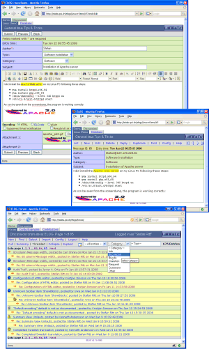

# The ELOG Home Page  

Home of the *Electronic Logbook* package by [Stefan
Ritt](mailto:Stefan.Ritt@psi.ch)

*Current version: 3.1.5*

[PDF version](https://elog.psi.ch/elog/pdf/document.pdf)

---

## What is ELOG ?  

**ELOG** is part of a family of applications known as **weblog*s* .
Their general purpose is :

1.  to make it easy for people to put information online in a
    chronological fashion, in the form of short, time-stamped text
    messages ("entries") with optional HTML markup for presentation,
    and optional file attachments (images, archives, etc.)
2.  to make it easy for other people to access this information through
    a Web interface, browse entries, search, download files, and
    optionally add, update, delete or comment on entries.

**ELOG** is a remarkable implementation of a *weblog* in at least two
respects :

- its simplicity of use : you don't need to be a seasoned server
  operator and/or an experimented database administrator to run **ELOG**
  ; one executable file (under Unix or Windows), a simple configuration
  text file, and it works. No Web server or relational database
  required. It is also easy to translate the interface to the
  appropriate language for your users.
- its versatility : through its single configuration file, **ELOG** can
  be made to display an infinity of variants of the *weblog* concept.
  There are options for what to display, how to display it, what
  commands are available and to whom, access control, etc. Moreover, a
  single server can host several **weblog*s*, and each *weblog* can be
  totally different from the rest.

## Screen shots  

On the left upper panel is a typical logbook page displayed by Netscape Navigator. Each
logbook page can contain attachments in a similar way to emails. This makes it possible
to store images or text files and retrieve them easily. You could for example attach a sample
configuration file which can later be copied to the local machine with the "*Save As\...*"
function of the Web browser.

Several logbooks can be served though a single **ELOG** server. Each logbook can use different
attributes for its entries. The logbook can then be searched using these attributes. The
right pane on the left image shows a search for all entries with attribute "*Type*" equal to  
"*Configuration*", and the lower pane shows the search result. It is also possible to use   
full-text search in attributes and the entry body.                                           
                                                
While logbook entries are usually displayed one entry per page, they can also be listed         
consecutively which makes it easy to produce a paper printout of a logbook.                    
                                                
Logbook pages can be edited or deleted. This feature can be turned off in the configuration 
file so that a logbook entries cannot be changed after being submitted.                 
                                               
An additional feature is the automatic generation of a notification email messages    
based on a certain type or category of a logbook entry.                                 
                                               
Also try out the **[online demo](http://elog.psi.ch/elogs/Linux%20Demo/)**

## Use cases  

The features of **ELOG** make it useful for several applications:

- **Personal Logbooks**. Personal notes can be written into **ELOG** and
  can then be retrieved from anywhere with a Web browser. This makes it
  handy for PC supporters who have to go around in companies or
  laboratories and don\'t want to carry their paper logbook with them.
  The same holds true for people traveling around a lot. The logbook
  database consists of plain ASCII files which can copied easily between
  different computers to have local access, for example on a notebook
  with no network connection.
- **Shared Logbooks**. Logbooks can be shared by several people, for
  reading and optionally for writing. This way workgroups can share and
  exchange information like in a (simplified) news group. This is
  supported by the *Reply* command in **ELOG** which creates
  "*threads*" of entries. Users can be notified by email when new
  entries are added to the logbook. Compared to that of a news server,
  the installation of **ELOG** is much simpler.
- **Small Databases**. Since arbitrary attributes can be defined for a
  logbook, it can be used as a small database with search facilities.
- **Problem collections**. A system can consist of two logbooks, in one
  of which users enter bugs or problems. If someone adds a problem, an
  email is automatically sent to the administrator, who can then copy
  the entry to the second logbook and add the solution to the problem.
  Users can then look up all fixed problems.
- **Shift Logbooks**. If the *Allow delete* and *Allow edit* flags are
  off, an entry cannot be modified once it\'s been entered. This can be
  useful for shift logbooks for example in accelerator control rooms
  where each entry becomes a "*document*" with a time and author
  stamp. **ELOG** was originally developed as a shift logbook for the
  [PiBeta](http://pibeta.psi.ch) and [Muegamma](http://meg.psi.ch)
  particle experiments at [PSI](http://www.psi.ch).
- **File collections**. Since files can be attached to **ELOG** entries,
  the system can be used to store and retrieve files. This can be used
  to store configuration files, which need to be accessible by several
  people over the web, or to store images. Since **ELOG** features an
  elaborate query facility, entries can be searched for by specifying
  several categories.

## License  

**ELOG** is released under the [GNU Public
License](http://www.gnu.org/copyleft/gpl.html) .

## Credits  

The author would like to give credits to following people:

- [Fred Pacquier](mailto:fredp@dial.oleane.com) for this Web site and
  the French translation
- [Recai Oktas](mailto:roktas@omu.edu.tr) and [Roger
  Kalt](mailto:roger.kalt@psi.ch) for the Debian package
- [djek](mailto:djek@xs4all.nl) for the Dutch translation
- [Heiko Scheit](mailto:Heiko.Scheit@mpi-hd.mpg.de) for many bug fixes
  and fruitful discussions
- [Julio Calvo](mailto:jhcalvo@arnet.com.ar) for the Spanish translation
- [Emiliano 'AlberT' Gabrielli](mailto:AlberT@SuperAlberT.it)
  for his idea of scaling attached images
- [Andreas Luedeke](mailto:andreas.luedeke@psi.ch)
  for continuing user support and deployment of ELOG at PSI

## Talks and presentations  

Here are some talks and presentations given at various occasions:

- Seminar at KIT, Karlsruhe, Jan. 2015. [Introduction
  talk](https://elog.psi.ch/elog/talks/2015_1_intro.pptx) by Stefan
  Ritt.
- Seminar at KIT, Karlsruhe, Jan. 2015. [Application of
  ELOG](http://elog.psi.ch/elog/talks/2015_1_accel.pptx) for accelerator
  operation at PSI by [Andreas Luedeke](mailto:andreas.luedeke@psi.ch).

---

*Content by [Stefan Ritt](https://www.psi.ch/en/ltp-muon-physics/people/stefan-ritt), Web pages
by [Fred Pacquier](mailto:fredp@mygale.org)*
