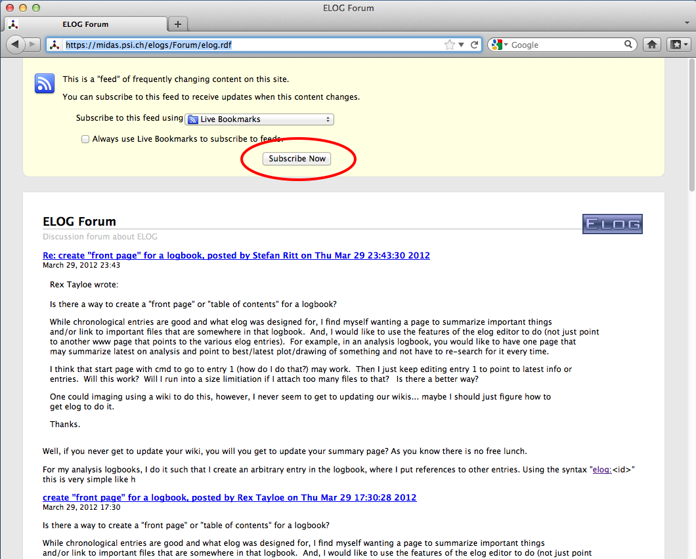
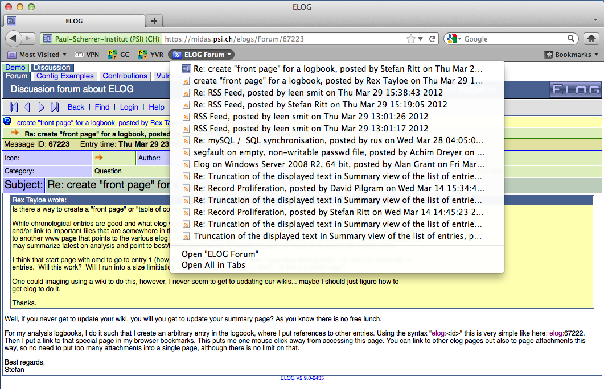

# ELOG User's Guide  

*How to get the most from your ELOG server*

------------------------------------------------------------------------

## A Quick Intro 

**ELOG** is part of a family of applications known as *weblogs*. Their
general purpose is :

1.  to make it easy for people to put information online in a
    chronological fashion, in the form of short, time-stamped text
    messages ("*entries*") with optional HTML markup for presentation,
    and optional file attachments (images, archives, etc.)
2.  to make it easy for other people to access this information through
    a Web interface, browse entries, search, download files, and
    optionally add, update, delete or comment on entries.

**ELOG** is a remarkable implementation of a *weblog* in at least two
respects :

- its simplicity of use : you don\'t need to be a seasoned server
  operator and/or an experimented database administrator to run **ELOG**
  ; one executable file (under Unix or Windows), a simple configuration
  text file, and it works. No Web server or relational database
  required. It is also easy to translate the interface to the
  appropriate language for your users.

- its versatility : through its single configuration file, **ELOG** can
  be made to display an infinity of variants of the *weblog* concept.
  There are options for what to display, how to display it, what
  commands are available and to whom, access control, etc. Moreover, a
  single server can host several **weblog*s*, and each *weblog* can be
  totally different from the rest.

  This is actually a problem when writing a User's Guide, because
  **ELOG** servers, and individual **weblogs** on one server, can vary
  wildly in appearance and functionality\... This guide only attempts to
  cover the main concepts of importance for **ELOG** users, describing
  the default "*out-of-the-box*" setup and how that behaviour may have
  been modified by the server administrator.

## What Words Mean Here 

Just to be clear, some definitions of terms that will be used throughout
the guide :

- **ELOG server** : the machine on which the **ELOG** server is run. Its
  operating system (Windows/Unix/Linux) and status (server/desktop) are
  not important, and of course it will probably do many other things
  besides.
- **ELOG administrator** : the person who has the authority to modify
  the **ELOG** configuration file on the server. May be an actual system
  administrator, a normal user of a server, or just the owner of a
  Windows PC.
- **logbook** : a *weblog* made available by the **ELOG** server. There
  may be many distinct such logbooks on one server.
- **entry** : the individual piece of information in a logbook. Can be
  as basic as a text message with a time-stamp, or carry much more
  information : attributes (see below), HTML markup, links, attached
  files\...

## Accessing an ELOG server and its logbook(s) 

To access a logbook, point your Web browser at the appropriate URL. The
default for a local Elog is **`http://localhost:8080/logbookname`**.
Logbook files are stored in directory **`logbookname`** which is a
sub-directory of the logbook root directory, defined by the
administrator. See the administrator guide on how to create a new
logbook.

If several logbooks are defined on the server, the entry page may be a
list of all logbooks, with their descriptions, number of entries, and
links to enter the logbook you want to use.

Alternatively, you may be taken directly to a specific logbook. By
default you will see a list of entries, but the administrator may have
defined a different "*default view*" for the logbook, like the list of
the day\'s entries, or directly display the last entry, etc. (depending
on what is most convenient for that logbook\'s purpose).

Each entry in a logbook is identified by an unique ID, which is last
part of the URL when that message is displayed. This ID might be used to
create a bookmark in a browser pointing directly to a specific entry.

There are four ways through which access to a logbook may be controlled:
it may be open for all to read ; it may require a common "*read*"
password for all users ; it may require each user to have an individual
user account (login name) and password ; finally, access may be granted
or not depending on the address of the workstation you are using.

## Viewing information in ELOG 

There are two main viewing modes in a logbook :

- the "**entry**" view : this is when only one entry is displayed on
  screen (like the latest entry when you first enter a logbook, or if
  you click on one in a list). Here are the various parts of the display
  :
  - if there are several logbooks on the **ELOG** server you will see a
    row of "*tabs*" at the top with the names of all the logbooks.
    These are link that allow to switch quickly between logbooks (*this
    may be disabled*).

  - below is a title bar with the name of the current logbook at the
    left, and the **ELOG** logo at the right. If you are logged in,
    there will be a "`Logged in as <username>`" reminder in between.

  - next is the "*menu bar*" : on the left is a series of links or
    buttons for **ELOG** commands available to you. These are explored
    in the sections below (*Note: different users may see different
    menus*). On the right is a "*VCR-like*" set of buttons for
    browsing, also explained later (*this may be disabled*).

  - after these comes the actual entry information. It always starts
    with the entry time-stamp, and may be followed by up to twenty
    "*attributes*". These are like fields in a database and have been
    defined specifically for the current logbook. Each attribute has a
    checkbox besides it, explained below (*this may be disabled*).

  - the full-width box below holds the textual content (message) of the
    entry. This can be plain-text or HTML code. Note that for some
    special applications (say, a photo album or an event log) the
    attributes and/or the attached files may be enough information, so
    this field may not always be present.

  - last and optionally, one or more attached files (that were uploaded
    to the server when the entry was created) are offered as clickable
    links for download or viewing, along with the file name and size. If
    these are images they may be displayed directly on the page.

    At the bottom of every page is a common "*footer*" for the
    logbook. By default this is just a link to the **ELOG** home page in
    Switzerland, but may be customized locally (typically to provide a
    navigation bar and links for integration with other Web sites).
- the "**search result**" views : these are basically lists of
  entries, resulting either from a "*Search*" command or from
  shortcuts such as "*Last X days*" and "*Last X entries*" commands
  (more on this below). This mode has many options, including :
  - a "*summary*" view : one entry per row in a table. Some attributes
    may not be displayed. If the entry text is displayed (or its first
    few lines), it goes into the rightmost column. Attachments are not
    displayed.

  - a "*classical weblog*" view : entries appear beneath one another,
    with attributes on one line and the text (and attachments, if
    present) below. Images may be displayed or just linked to.

  - entries may appear most recent first, or in reverse.

  - menus on list views are different from the entry view menu. By
    default they only have two or three commands, but they may have been
    customized by the administrator to add more.

    All these lists have a number to the left of each listed entry, that
    is a link to the corresponding entry view.

## Browsing around and finding things 

There are several interesting ways to peruse the information in a
logbook :

- **weblogs**" are often used for applications where chronology (time) is
  relevant, so a very common approach is to see "*what happened
  last*". In **ELOG** there are two commands for this. They are
  actually shortcuts for searches, to display the last day\'s (24 hrs)
  entries, or the last 10 entries (regardless of age). Note that the
  menus on the "*search result*" views of these commands are a bit
  special : they have the same command that created them, but with the
  search "*interval*" doubled. From the "*last day*" list you can
  get the "*last 2 days*" list, from that one the "*last 4 days*",
  etc., and similarly for "*last 10*", "*last 20*", etc., making it
  easy to quickly go back in time.
- another useful method, very specific to **ELOG**, is "*filtered
  browsing*" - again, shortcuts for specific searches. On the entry
  view, the "*VCR*" buttons normally let you see the previous, next,
  first or last entry in the logbook. However, if on the current entry
  you check one (or more) of the checkboxes in front of the attributes,
  only entries having the same value for the checked attribute(s) will
  be displayed by the browse buttons. Thus you can quickly flip through
  all the entries you submitted yourself, or of a certain type/category,
  depending on what attributes have been defined.
- for custom searches there is the query form given by the "*Find*"
  command. This lets you look for entries between two dates, with
  particular values for any attribute, or containing specific text. If
  you fill in several fields, only entries that meet **ALL** criteria
  will be selected. Possible options include sort order and summary view
  for results, printer-friendly formatting, displaying attachments or
  not, and searching through all logbooks on the **ELOG** server (if
  applicable).

## Adding stuff to a logbook 

If you have "*write access*" to a logbook (by one of the same four
methods as for read access), then you may use the "*New*", "*Edit*",
"*Reply*" and "*Delete*" commands.

For the quality of the information committed to the logbook, you need
understand and use these as well as possible. Here are some of the
important features for each commmand :

- **New** :
  - you will not be able to save your entry if all attributes marked
    with a red star (\*) are not filled in.
  - some attributes may be pre-filled from system variables (like your
    user name). Pre-filled attributes may be still editable or read-only
    (like the entry creation date).
  - attributes may be text fields (limited to 100 characters),
    list-boxes (max. 100 values), or check-boxes. There is also a
    special type of attribute where several values are listed on a line
    with check-boxes, and you can check as many values as needed.
  - a nice touch : URLs in attributes (http://\..., ftp://\...,
    mailto:\...) are automatically converted to links.
  - in addition to the above URLs, one can enter a tag **elog:\<id\>**
    which references another logbook entry. The tag
    **elog:\<logbook\>/\<id\>** references a message in another logbook
    on the same server. The tag **elog:\<id\>/\<n\>** references
    attachment number **n** in a logbook entry. To reference an
    attachment in the current message, one uses **elog:/\<n\>**. An
    anchor inside an entry can be referenced with
    **elog:\<id\>#\<anchor\>**.
  - the Text multi-line field, if present, may be pre-filled with a
    template if entries need to have a common, consistent format across
    the logbook (especially for HTML). There may also be a comment
    inserted before it to explain local rules and conventions, upload
    rules, etc.
  - check the "*Submit as HTML*" box if the entry contains HTML
    markup.
  - a logbook may be configured to send a notification e-mail to various
    recipients each time an entry is submitted. This may be the default
    behaviour, and you should check "*Suppress notification*"" if it is
    not wanted. Or it may be checked by default, and you need to
    explicitely uncheck it to send the mail. Then again, you may not
    have a choice\... (note that notifiation recipients may or may not
    be disclosed).
  - if the logbook allows attachments, there will be a number of fields
    with "*Browse*" buttons at the bottom of the form. Use these to
    pick one or more files on your local computer, they will be uploaded
    to the **ELOG** server as you submit the form. IMPORTANT : there is
    an upper limit on the size of individual attached files. By default
    it is about 1 MB but can be changed by the administrator.
- **Edit** :
  - normally the Edit form will have all the values of the existing
    entry in its fields for modification. However, sometimes you may see
    fields that have been blanked if this makes sense for a particular
    logbook application (e.g. a "*Last modified by*" field).
  - the "*Submit as new entry*" checkbox only appears on Edit forms.
    If it is unchecked, the modified entry keeps its original creation
    time-stamp. If it is checked, the modified entry becomes the latest
    in the logbook, as if it had just been created. Again, it is
    possible that this is checked by default, or disabled altogether on
    some logbooks.
  - managing attachments through this form is easy. If all you want to
    change is the attributes or text, don\'t touch the fields at the
    bottom and the original attachments will be preserved. If you want
    to add an additional attachment, use an empty field. If you want to
    update an existing file, use the "*Browse*" button below that
    file\'s name to specify the new one. Lastly, if you want to delete
    an attachment without upoading a new one in its place, you must type
    the magic word "`<delete>`" in the field below its name.
- **Reply** :
  - this command creates a new entry, but with the current entry\'s text
    "*quoted*" (with \'\>\') in the compose form, much like when
    replying to e-mail.
  - the new entry has a special "*In reply to*" attribute with a link
    to the original entry ; the latter also acquires a "*Reply*"
    attribute with a link to the new entry. Unfortunately these links
    cannot be trusted in the present **ELOG** storage system, and the
    whole scheme gets somewhat confusing when there are several replies.
- **Delete** :
  - nothing much to say about this one, except that there is no
    "*Recycle bin*" or whatever : once you have confirmed the deletion
    of an entry, it\'s gone for good, so be careful ! (same holds for
    the replacement or deletion of an attached file).

## Misc. tips & tricks, things to be aware of\... 

- you can link directly to a specific entry by its URL, using the
  message ID (from another entry or an external Web page). It is also
  possible to link to a search result this way: use the "*Search*"
  form to compose a query that will result in exactly what you want
  (either a single entry or a list of entries). Copy the URL for that
  result page from your browser, and use that as the target for your
  link.

- right now you cannot search entries for attachments by their file
  name.

- right now attributes that consist of just a checkbox ("*boolean*")
  can only be searched by "*checked*" state in the "*Search*" form.
  However, if you start from an entry where that attribute is unchecked,
  you can use "*filtered browsing*" to flip through all other entries
  where it is also unchecked.

- as mentioned above, the "*Reply*" command only provides a basic
  comment/chat facility - a full-blown discussion board is not
  **ELOG**'s purpose. If a logbook has a very specific purpose and
  format (picture gallery, event log, file library etc.) it might be a
  good idea to disable that command there and move all
  chat/comments/discussions to a separate, dedicated logbook to avoid
  "*visual pollution*".

- it is important to understand that currently the **ELOG** server
  application is "*single-process*" and "*non-streaming*". In normal
  terms this means that :
  - only one request is processed at any one time by the server.

  - uploading or downloading an attachement file is a single request,
    and causes the entire file to be loaded in server memory while the
    request is being processed.

    This is not normally a problem for the sort of short, text-mode
    entries **ELOG** is designed to support. However, if a user starts
    to upload or download a large attachment file (or image) over a slow
    link, all other users on that **ELOG** server will have to wait for
    that transfert to finish before they can access any logbook on that
    server. This is why there is a low limit on the size of attachments,
    and why **ELOG** should not be used to distribute large files under
    intensive multi-user conditions.

- It is possible to use bookmarks to pre-populate various attributes
  when submitting an **ELOG** entry. This can be useful if the same
  person often creates similar entries from the same PC. For example,
  with a bookmark of the form:

      http://your.host/your_logbook/?cmd=New&pauthor=joe&ptype=Info

  \...a new entry is created, with the "*author*" field pre-populated
  with "*joe*" and the "*Info*" value preselected for the "*type*"
  field. The same is possible for any attribute defined in the logbook
  (note the leading "p"). Thus you can define a set of bookmarks for
  various types of logbook entries.

## elog command line client

In addition to submission of logbook entries through the Web interface, the standalone "*client*" program **`elog`** can be used.

The parameters are:

``` text
elog <parameters>

	-h <hostname>            Hostname where elogd is running
	[-p port]                Port where elogd is running
	[-d subdir]              URL Directoy where elogd is running
	-l logbook               Name of logbook
	-s                       Use SSL for communication
	[-v]                     For verbose output
	[-w password]            Write password defined on server
	[-u username password]   User name and password
	[-f <attachment>]        Up to 50 attachments
	-a <attribute>=<value>   Up to 50 attributes
	[-r <id>]                Reply to existing message
	[-q]                     Quote original text on reply
	[-e <id>]                Edit existing message
	[-x]                     Suppress email notification
	[-n 0|1|2]               Encoding: 0:ELcode,1:plain,2:HTML
	-m <textfile>] | <text>
```
  
  Arguments with blanks must be enclosed in quotes. The elog message can
  either be submitted on the command line, piped in like

`cat text | elog -h ... -l ... -a ...`

  or in a file with the -m flag. Multiple attributes and attachments can
  be supplied. If attributes with multiple possible values are defined
  in a logbook (via the *"MOptions"* keyword), they can be separated
  with a "\|", like **`-a "<attribute>=<value1> | <value2>"`**. The
  message text can be supplied directly at the command line or submitted
  from a file with the **`-m`** flag.
  
  The **`elog`** program makes it possible to submit logbook entries
  automatically by the system or from scripts. In some shift logbooks
  this feature is used to enter alarm messages automatically into the
  logbook.

## RSS Feed

RSS (RDF Site Summrary or Really Simple Syntication) is a web feed
format to publish frequently new or updated ELOG entries. This is a bit
like the email notifications present in ELOG, but the RSS system does
not go through an email reader, but through a dedicated RSS reader. This
helps to seperate ELOG updates form other email or spam. An RSS
"channel" can be subscribed to, so one gets notified whenever a new or
updated entry exists. One can either use a dedicated RSS reader or
aggregator, or use the RSS functionality of a web browser, such as
Firefox or Google Reader.

To obtain the RSS feed, one simply has to request the file
**`elog.rdf`** from a logbook. For the ELOG forum, one can enter the URL

[`https://elog.psi.ch/elogs/Forum/elog.rdf`](https://elog.psi.ch/elogs/Forum/elog.rdf)

The browser then offers the possiblity to subscribe to that logbook:



In case of "Live Bookmarks" in Firefox, new logbook entries
automatically appear in the bookmark list:



Standalone RSS reader can also notify the user of new entries with
dialog boxes and sounds. For a list of availabel RSS aggregators, see
[here](http://en.wikipedia.org/wiki/Comparison_of_feed_aggregators).
